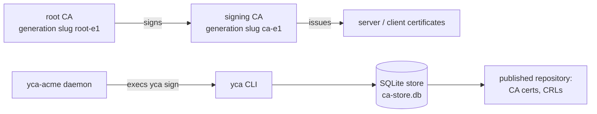

# yca - a private CA

A two-tier X.509 certificate authority for a private PKI, aiming RFC 5280
compliance. A C++ command line tool (Botan) owns the CA store and all
signing; a separate Go daemon (`yca-acme`) adds RFC 8555 (ACME) issuance
on top of it. Certificates and CRLs are published as static files behind
a plain HTTP server; revocation is CRL-only.



## Limitations

- **ECDSA only.** Curves `secp256r1`, `secp384r1`, `secp521r1`; digests
  `SHA-256`, `SHA-384`, `SHA-512` (Botan's names, verbatim, no aliases:
  `prime256v1` is rejected). RSA keys and CSRs are not supported.
- **Fixed policy OID structure.** CertificatePolicies is built from one
  configurable arc (`root_arc_oid`, intended to be an org PEN) with
  hardcoded suffixes: `<arc>.1.1` (TLS server), `<arc>.1.2` (VPN/mTLS
  client). Only the arc is configurable; without it no policies are
  emitted.
- **Narrow HSM support.** The `pkcs11` key backend is tested against
  SoftHSM2 and the Nitrokey HSM 2 via OpenSC only. Root and
  signing keys live on the token and never leave it; EE keys are always
  software.
- **Two EE profiles.** `server` and `client` only; no code signing,
  S/MIME or document signing.
- **CRL-only revocation.** No OCSP responder; status is served by the
  published signing and root CRLs, re-signed on timers.
- **No root rotation or cross-signing.** The signing CA rotates
  (`renew signing-ca`); the root does not. See docs/ca-rotation.md.

## Configuration (`yca.toml`)

TOML, parsed with toml++. Default path `./yca.toml`, override with
`--config`.

| Key | Meaning |
|-----|---------|
| `org_name` | `O=` in the CA DNs; any script (UTF8String) |
| `country_code` | `C=` in the CA DNs; exactly 2 letters |
| `repository_host` | `host[:port]` serving the published artifacts; used to build the CDP and AIA (caIssuers) URLs in certificates |
| `root_ca_cn` | root CA display name (`CN=`); any script |
| `root_ca_curve` | root key curve |
| `root_ca_digest` | root signature digest (also signs the root CRL) |
| `root_ca_valid_days` | root certificate validity |
| `root_ca_slug_prefix` | file/URL identifier; the slug is `<prefix><generation>` (generation 1 at init) |
| `signing_ca_cn` | signing CA display name |
| `signing_ca_curve` | signing key curve |
| `signing_ca_digest` | signing signature digest (also signs the signing CRL) |
| `signing_ca_valid_days` | signing certificate validity |
| `signing_ca_slug_prefix` | as the root prefix; the two must differ, and not only by trailing digits |
| `ee_curve` | EE key curve (`create` generates on it, `sign` requires the CSR key on it) |
| `ee_digest` | EE signature digest |
| `ee_valid_days` | default and ceiling for EE validity; at most 398 |
| `root_arc_oid` | optional dotted OID arc (org PEN) for CertificatePolicies; absent means no policies extension |
| `key_backend` | `internal` (default: software keys, passphrase-encrypted in the store) or `pkcs11` |
| `pkcs11_module` | path to the PKCS#11 provider `.so` (required with `pkcs11`) |
| `pkcs11_token_label` | token label (required with `pkcs11`) |

Constraints enforced at load: curves/digests from the sets above; slug
prefixes lowercase kebab-case `[a-z0-9.-]`; `repository_host` a DNS host
name with optional port (no scheme or path);
`ee_valid_days < signing_ca_valid_days < root_ca_valid_days`.

`yca init` snapshots the config into the store (`ca_config` table),
which becomes the source of truth: every field is locked, and later
edits to `yca.toml` are warned about and ignored. Per-issuance
flexibility comes from `--valid` instead. `yca get config` prints the
locked config.

Example:

```toml
org_name = "Example 会社"
country_code = "CA"
repository_host = "pki.example.ca"
root_ca_cn = "ETS Root E1"
root_ca_curve = "secp384r1"
root_ca_digest = "SHA-384"
root_ca_valid_days = 8192
root_ca_slug_prefix = "root-e"
signing_ca_cn = "CA E1"
signing_ca_curve = "secp384r1"
signing_ca_digest = "SHA-384"
signing_ca_valid_days = 8112
signing_ca_slug_prefix = "ca-e"
ee_curve = "secp256r1"
ee_digest = "SHA-256"
ee_valid_days = 397
root_arc_oid = "1.3.6.1.4.1.32473" # org PEN arc (optional)

# HSM-held CA keys (optional; default internal). PIN from CA_HSM_PIN.
#key_backend = "pkcs11"
#pkcs11_module = "/usr/lib/opensc-pkcs11.so"
#pkcs11_token_label = "yts"
```

## CLI

```
yca [--config PATH] [--store DIR] <action> <target> [options]
```

Global options: `--config` (default `./yca.toml`), `--store` (default
`./store`), `--version`. Secrets come from the environment:
`CA_STORE_PASSPHRASE` (internal backend) or `CA_HSM_PIN` (pkcs11
backend). Read-only commands (`get`, `list`) need neither.

| Command | Purpose |
|---------|---------|
| `init` | initialize the PKI: root + signing CA. A passphrase is generated and shown once if `CA_STORE_PASSPHRASE` is unset. Fails if already initialized. |
| `create <server\|client> --cn <cn> [--san type:name ...] [--valid <N><s\|m\|h\|d>]` | issue an EE cert with a locally generated key, delivered under `ee/`. `server` always includes `DNS:CN`; `client` requires at least one `--san`. |
| `enroll --id <id>` | enroll an identity (e.g. an email) for CSR signing |
| `get nonce --id <id>` | issue/return the identity's single-use nonce (5 minutes, idempotent while fresh) |
| `sign <server\|client> --id <id> --nonce <n> --csr <pem\|-\|path> [--valid ...]` | issue from an external PKCS#10 CSR, gated by the `(id, nonce)` pair. Only the public key (must be ECDSA on `ee_curve`), subject CN and supported SANs are taken from the CSR. Writes nothing under `ee/`; prints the CN so it pipes into `get`. |
| `revoke <server\|client\|ca> [--cn <cn> \| --serial <hex>] [--reason <CRLReason>]` | revoke the newest active cert by CN, or the exact one by serial; the entry goes on the CRL of the issuing generation. `revoke ca` revokes a signing CA generation by `--cn` onto the root CRL (refused for the active issuer; `renew signing-ca` first). |
| `renew signing-ca --new-cn <cn>` | rotate: the successor generation issues from then on, the predecessor keeps publishing its CRL |
| `refresh crl [root\|signing\|all]` | re-sign the published CRLs: same unexpired entries, crlNumber+1, fresh dates; expired entries are pruned per RFC 5280 3.3. Covers every live generation of the scope. |
| `get <server\|client\|ca\|crl\|config\|nonce> [--cn <cn>] [--id <id>] [--encoding pem\|der]` | export to stdout. `ca`/`crl` take `--cn root-ca\|signing-ca` (or a generation CN); `--cn -` reads the CN from stdin. |
| `list <filter> [--tsv] [--limit N]` | one filter of `--expiring [N]`, `--expired [N]`, `--revoked [N]`, `--last [N]` (window in days) or `--cn <cn>`; indexed, no full store scan |

`--valid` requests a shorter validity for one issuance, range
`[5m, ee_valid_days]`; the locked policy is both the default and the
ceiling.

Examples:

```
yca create server --cn server.example.ca --san dns:alt.example.ca
yca enroll --id user@example.ca
yca sign server --id user@example.ca \
    --nonce $(yca get nonce --id user@example.ca) --csr server.csr | \
    yca get server --cn -
yca revoke server --cn server.example.ca --reason superseded
yca get ca --cn root-ca --encoding der
yca get crl --cn signing-ca --encoding der
yca list --expiring 30
```

Examples for every flow are in docs/operation.md.

## Operations

- **Install.** `yca/install.sh [prefix]` builds the release variant and
  installs `yca`, `yca-acme`, man pages, zsh completions, and (as root)
  the systemd units. Provisioning (service user, store directory,
  `yca init`, enabling timers) is deliberately manual: a CA init is a
  ceremony. Step-by-step walkthrough: docs/install.md.
- **Issuance.** Either `create` (the CA generates the key and delivers
  cert + key under `ee/`) or the CSR pipeline `enroll` / `get nonce` /
  `sign` (the CA never sees the private key; delivery via `get`).
  Servers can instead use ACME below.
- **Revocation and CRLs.** `revoke`, then the CRLs do the rest. Two
  cadences, each on its own systemd timer: the signing CRL promises
  re-publication within 7 days (refreshed daily), the root CRL within
  183 days (refreshed quarterly, offline-root practice). After
  `revoke ca`, run `yca refresh crl root` immediately: relying parties
  may cache the root CRL for up to 6 months.
- **Publication.** A timer rsyncs `store/ca/` (CA certs `.crt`, CRLs
  `.crl`) to the web root served at `repository_host`; the CDP and
  caIssuers URLs in issued certificates point there.
- **Rotation.** `renew signing-ca` for the signing CA; design and
  runbook in docs/ca-rotation.md and docs/operation.md.
- **ACME.** `yca-acme` exposes RFC 8555 issuance for the server profile:
  EAB-gated accounts, http-01 and dns-01 (wildcards included),
  revokeCert, ARI (RFC 9773). It owns only protocol state and execs the
  `yca` CLI to sign; verified with acme.sh and certbot. Setup: 
  docs/acme-operation.md.

## Build and test

`yca/build.sh` builds `yca`, `yca-seed` (load-test seeder, never
installed), `yca_tests` and `yca-acme`; `build.sh release` for the
release variant, `build.sh tests` to also run the four CTest suites
(`unit`, `e2e`, `e2e-hsm` on an ephemeral SoftHSM2 token, `e2e-acme`
against a real ACME client) plus the Go tests. Tested on:
Arch Linux/AMD64, Gentoo/AARCH64, FreeBSD 15.1/AMD64, macOS 26/ARM64.

## License

Copyright 2026 p7cq. Licensed under the Apache License, Version 2.0,
see [LICENSE](LICENSE).

Vendored and module dependencies are under their own permissive licenses
(BSD, MIT, public domain), see
[THIRD_PARTY_NOTICES.md](THIRD_PARTY_NOTICES.md).
