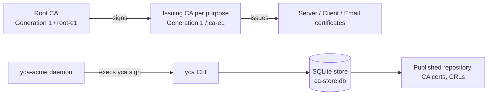

# yca - a private CA

A two-tier X.509 certificate authority for a private PKI, aiming RFC 5280
compliance. A C++ command line tool (Botan) owns the CA store and all
signing; a separate Go daemon (`yca-acme`) adds RFC 8555 (ACME) issuance
on top of it. Certificates and CRLs are published as static files behind
a plain HTTP server; revocation is CRL-only.


```mermaid
flowchart LR
    R[Root CA<br/>Generation 1 / root-e1] -->|signs| S[Issuing CA per purpose<br/>Generation 1 / ca-e1]
    S -->|issues| EE[Server / Client / Email certificates]
    CLI[yca CLI] --> ST[(SQLite store<br/>ca-store.db)]
    ACME[yca-acme daemon] -->|execs yca sign| CLI
    ST --> PUB[Published repository:<br/>CA certs, CRLs]
```

The hierarchy is two tiers: one root, and one issuing CA per *purpose*
(`[ca.tls]`, `[ca.mtls]`, ...), each carrying the EE profiles it is
allowed to issue. A single issuing CA is the ordinary case; the profile
being issued is what picks the CA that signs.

## Limitations

- **ECDSA only.** Curves `secp256r1`, `secp384r1`, `secp521r1`; digests
  `SHA-256`, `SHA-384`, `SHA-512` (Botan's names, verbatim, no aliases:
  `prime256v1` is rejected). RSA keys and CSRs are not supported.
- **Fixed policy OID structure.** CertificatePolicies is built from one
  configurable arc (`arc_oid`, intended to be an org PEN) with suffixes
  fixed by the profile table: `<arc>.1.1` (TLS server), `<arc>.1.2`
  (VPN/mTLS client), `<arc>.1.3` (S/MIME). Only the arc is configurable;
  without it no policies are emitted.
- **Narrow HSM support.** The `pkcs11` key backend is tested against
  SoftHSM2 and the Nitrokey HSM 2 via OpenSC only. pkcs11-backed CA keys
  live on their token and never leave it; EE keys are always software.
- **HSM: single token is the default layout.** With `[pkcs11]
  token_label` and no per-CA label both CA keys share one token, which
  must be available for routine issuance - the root is then not truly
  offline. The split layout (a `token_label` of its own under `[root]`)
  puts the root key on its own token, and the hybrid layout (`[root]
  key_backend = "pkcs11"` with the issuing CA internal) keeps only the
  root on a token; in both, daily issuance runs without the root token.
- **Fixed subject DN structure.** Every DN is encoded `C`, `O`, `CN` in
  that order (from `country_code`, `org_name` and the certificate's own
  common name); no other attributes (OU, L, ST, serialNumber) can be
  added. A CA certificate always carries the full DN. For the leaves a CA
  issues, `[ca.<purpose>] simple_dn = true` reduces it to the bare `CN`,
  which a profile whose subject must be organizational (`email`) refuses.
  A `directoryName` name constraint is compared position by position, so
  only this order can sit inside one.
- **TLS and S/MIME profiles.** `server`, `client` and `email`, which is
  what fits within what Botan offers: the Code Signing BR leave no
  extendedKeyUsage that a code signing CA can carry and Botan will still
  sign with, so code signing and document signing are not issued. Each
  profile belongs to one issuing CA, and a CA carries the EKUs of the
  profiles it lists, so a verifier that intersects EKUs along a chain
  rejects a leaf its issuer had no business signing.
- **Name constraints are `dNSName` and `rfc822Name` only.** An issuing CA
  can be bounded by `permitted_dns` and `permitted_email`, but not by
  `directoryName`, which the S/MIME BR also require of a technically
  constrained CA. Excluded subtrees are not supported.
- **CRL-only revocation.** No OCSP responder; status is served by the
  published issuing and root CRLs, re-signed on timers.
- **No root rotation or cross-signing.** Issuing CAs rotate
  (`renew signing-ca --purpose <p>`); the root does not.

## Configuration (`yca.toml`)

Format: TOML; default path `./yca.toml`, override with `--config`.

The file is organized in sections, which is also the granularity at
which it is locked into the store: `[pki]`, an optional `[pkcs11]`, the
trust anchor `[root]`, and one `[ca.<purpose>]` per issuing CA. The
purpose names the section, so TOML itself rejects a duplicate.

`[pki]`

| Key | Meaning |
|-----|---------|
| `org_name` | `O=` in the CA DNs; any script (UTF8String) |
| `country_code` | `C=` in the CA DNs; exactly 2 letters |
| `repository_host` | `host[:port]` serving the published artifacts; used to build the CDP and AIA (caIssuers) URLs in certificates |
| `arc_oid` | optional dotted OID arc (org PEN) for CertificatePolicies; absent means no policies extension |

`[pkcs11]`, present only when some CA holds its key on a token

| Key | Meaning |
|-----|---------|
| `module` | path to the PKCS#11 provider `.so` |
| `token_label` | default token label, used by every token-held CA that declares none of its own |

`[root]` and `[ca.<purpose>]` share these

| Key | Meaning |
|-----|---------|
| `cn` | CA display name (`CN=`); any script |
| `curve` | CA key curve |
| `digest` | CA signature digest (also signs this CA's CRL) |
| `valid_days` | CA certificate validity |
| `slug_prefix` | file/URL identifier; the slug is `<slug_prefix><generation>` (`<generation>` is 1 at init) |
| `key_backend` | `internal` (default: software key, passphrase-encrypted in the store) or `pkcs11` |
| `token_label` | this CA's token; only with `key_backend = "pkcs11"`, defaults to `[pkcs11] token_label` |

`[ca.<purpose>]` adds

| Key | Meaning |
|-----|---------|
| `profiles` | the EE profiles this CA issues, from `server`, `client`, `email`; each profile belongs to exactly one CA |
| `ee_curve` | EE key curve (`create` generates on it, `sign` requires the CSR key on it) |
| `ee_digest` | EE signature digest |
| `ee_valid_days` | default and ceiling for EE validity under this CA; capped by the strictest profile it lists (398 for `server`/`client`, 825 for `email`) |
| `simple_dn` | optional, default `false`; `true` reduces the subject DN of the leaves this CA issues to the bare `CN`, dropping `C` and `O`. Never applies to the CA's own certificate, and refused on a CA carrying a profile whose subject must be organizational (`email`) |
| `permitted_dns` | optional `nameConstraints` permitted subtrees, as bare FQDNs; `example.ca` also covers `www.example.ca` |
| `permitted_email` | optional `nameConstraints` permitted subtrees, as FQDNs; `example.ca` means every mailbox at that host, `.example.ca` every mailbox in a subdomain of it |

Constraints enforced: curves/digests from the sets above; purposes and
slug prefixes lowercase kebab-case `[a-z0-9.-]`; `repository_host` a DNS
host name with optional port (no scheme or path); slug prefixes and CNs
unique across all CAs, and no two prefixes differing only by digits (they
would collide once generations are appended);
`ee_valid_days < valid_days` per CA and every CA's `valid_days` below the
root's. An `internal` root under a `pkcs11` issuing CA is rejected (it
would protect the replaceable key better than the anchor). A `pkcs11`
field nothing uses is an error rather than something to ignore: a
`token_label` on an `internal` CA, a `[pkcs11]` section no CA draws on,
or a `[pkcs11] token_label` that every token-held CA overrides.

Each profile belongs to exactly one CA, which is how issuance picks an
issuer: `create server` routes to whichever CA lists `server`. A profile
no CA claims is not a configuration error, it simply means this PKI does
not issue it, and issuance says so. `email` is CSR-only: it is issued
through `enroll` / `get nonce` / `sign`, never through `create`, so the
CA never holds an S/MIME private key.

A CA carries the EKUs of the profiles it lists. A CA listing `email` also
carries `clientAuth`, which the S/MIME Baseline Requirements permit on a
subordinate CA (7.1.2.2) and public S/MIME intermediates ship; the leaf
still carries `emailProtection` alone.

Slug prefixes: the stable part of the CA slugs (file/URL names, pkcs11 
key labels). The full slug is `<slug_prefix><generation>` at init;
signing CA rotation increments its generation.

On-token key labels are the derived slugs: at init an existing keypair
MUST already be labeled `<slug_prefix>1` to be adopted (curve-checked),
and a missing one WILL be generated on the token under exactly that
label (`root-e1` and `ca-e1` in the example below).

`yca init` snapshots the config into the store, which becomes the
definitive reference: all fields are locked, and later edits to
`yca.toml` are warned and ignored. The snapshot follows the sections:
`ca_config` holds `[pki]`, `[pkcs11]` and `[root]` under dotted keys,
`ca_purpose` holds one row per issuing CA. A section is frozen when it is
created, which is what will let a CA be added to an initialized store
without re-initializing it. `yca get config` prints the snapshot back in
the same sections, so its output is itself a valid `yca.toml`.

Example:

```toml
[pki]
org_name = "Example 会社"
country_code = "CA"
repository_host = "pki.example.ca"
arc_oid = "1.3.6.1.4.1.32473" # org PEN arc (optional)

[root]
cn = "ETS Root E1"
curve = "secp384r1"
digest = "SHA-384"
valid_days = 7164
slug_prefix = "root-e"

[ca.tls]
profiles = ["server", "client"]
cn = "CA E1"
curve = "secp384r1"
digest = "SHA-384"
valid_days = 1194
slug_prefix = "ca-e"
ee_curve = "secp256r1"
ee_digest = "SHA-256"
ee_valid_days = 398

# HSM-held CA keys (optional; default internal). PIN from CA_HSM_PIN.
# [pkcs11]
# module = "/usr/lib/opensc-pkcs11.so"
# token_label = "ets"
#
# Then per CA, in the sections above:
#   [root]    key_backend = "pkcs11"
#   [ca.tls]  key_backend = "pkcs11"
# Split layout: the root key on its own token, plugged in only for
# ceremonies. PIN from CA_HSM_ROOT_PIN (falls back to CA_HSM_PIN).
#   [root]    token_label = "ets-root"
# Hybrid layout: only [root] on a token, issuing keys internal
# (passphrase-encrypted in the store).
```
Note: `1.3.6.1.4.1.32473` is the IANA documentation PEN (RFC 5612), used here as a placeholder.

## CLI

```
yca [--config PATH] [--store DIR] <action> <target> [options]
```

Global options: `--config` (default `./yca.toml`), `--store` (default
`./store`), `--version`. Secrets come from the environment:
`CA_STORE_PASSPHRASE` (keys on the internal backend), `CA_HSM_PIN`
(signing token) and `CA_HSM_ROOT_PIN` (root token; falls back to
`CA_HSM_PIN`). An operation needs only the secrets of the CA keys it
touches - daily issuance never needs the root secret. Read-only commands
(`get`, `list`) need none.

| Command | Purpose |
|---------|---------|
| `init` | initialize the PKI: the root plus every declared `[ca.<purpose>]`, in one root ceremony. A passphrase is generated and shown once if `CA_STORE_PASSPHRASE` is unset. Fails if already initialized. |
| `add signing-ca --purpose <p>` | create an issuing CA the config declares but the store does not hold. Root key ceremony; the section is locked as it is created, so a CA can join an initialized store without re-initializing it. |
| `create <server\|client> --cn <cn> [--san type:name ...] [--valid <N><s\|m\|h\|d>]` | issue an EE cert with a locally generated key, delivered under `ee/`. `server` always includes `DNS:CN`; `client` requires at least one `--san`. |
| `enroll --id <id>` | enroll an identity (e.g. an email) for CSR signing |
| `get nonce --id <id>` | issue/return the identity's single-use nonce (5 minutes, idempotent while fresh) |
| `sign <server\|client> --id <id> --nonce <n> --csr <pem\|-\|path> [--valid ...]` | issue from an external PKCS#10 CSR, gated by the `(id, nonce)` pair. Only the public key (must be ECDSA on `ee_curve`), subject CN and supported SANs are taken from the CSR. Writes nothing under `ee/`; prints the CN so it pipes into `get`. |
| `revoke <server\|client\|ca> [--cn <cn> \| --serial <hex>] [--reason <CRLReason>]` | revoke the newest active cert by CN, or the exact one by serial; the entry goes on the CRL of the issuing generation. `revoke ca` revokes a signing CA generation by `--cn` onto the root CRL (refused for the active issuer; `renew signing-ca` first). |
| `renew signing-ca [--purpose <p>] --new-cn <cn>` | rotate one issuing CA: the successor generation issues from then on, the predecessor keeps publishing its CRL. Other purposes are untouched. `--purpose` is required once several issuing CAs exist. |
| `refresh crl [root\|signing\|all]` | re-sign the published CRLs: same unexpired entries, crlNumber+1, fresh dates; expired entries are pruned per RFC 5280 3.3. Covers every live generation of the scope. |
| `get <server\|client\|ca\|crl\|config\|nonce> [--cn <cn>] [--id <id>] [--encoding pem\|der] [--chain]` | export to stdout. `ca`/`crl` take `--cn root-ca\|<purpose>-ca` (or a generation CN); `signing-ca` still works while exactly one issuing CA exists; `--cn -` reads the CN from stdin. `--chain` appends the issuers, nearest first, stopping below the self-signed root that relying parties already hold; `server`/`client`/`ca` only, and PEM only, since DER cannot be concatenated. |
| `list <filter> [--tsv] [--limit N]` | one filter of `--expiring [N]`, `--expired [N]`, `--revoked [N]`, `--last [N]` (window in days) or `--cn <cn>`; indexed, no full store scan |

`--valid` requests a shorter validity for one issuance, range
`[5m, ee_valid_days]`; the locked policy is both the default and the
ceiling.

Examples:

```
yca create server --cn server.example.ca --san dns:alt.example.ca
yca enroll --id user@example.ca
yca sign server --id user@example.ca \
    --nonce $(yca get nonce --id user@example.ca) --csr server.csr | \
    yca get server --cn -
yca revoke server --cn server.example.ca --reason superseded
yca get ca --cn root-ca --encoding der
yca get crl --cn signing-ca --encoding der
yca list --expiring 30
```

The server certificate issued above, under the example configuration
(`yca get server --cn server.example.ca | openssl x509 -text -noout`,
key and signature bytes elided):

```
Certificate:
    Data:
        Version: 3 (0x2)
        Serial Number:
            b4:b9:c9:50:8f:04:b6:b3:58:90:6a:0b:16:4c:76:29
        Signature Algorithm: ecdsa-with-SHA256
        Issuer: CN=CA E1, C=CA, O=Example 会社
        Validity
            Not Before: Jul 23 12:05:36 2026 GMT
            Not After : Aug 24 12:05:36 2027 GMT
        Subject: CN=server.example.ca
        Subject Public Key Info:
            Public Key Algorithm: id-ecPublicKey
                Public-Key: (256 bit)
                pub:
                    04:...
                ASN1 OID: prime256v1
                NIST CURVE: P-256
        X509v3 extensions:
            Authority Information Access: 
                CA Issuers - URI:http://pki.example.ca/ca-e1.crt
            X509v3 Subject Key Identifier: 
                AB:B2:86:88:3C:C5:30:4F:B6:9C:CF:44:6F:8F:AE:7B:78:CE:EE:95:C6:6B:D8:F9
            X509v3 Key Usage: critical
                Digital Signature
            X509v3 Subject Alternative Name: 
                DNS:alt.example.ca, DNS:server.example.ca
            X509v3 Basic Constraints: critical
                CA:FALSE
            X509v3 CRL Distribution Points: 
                Full Name:
                  URI:http://pki.example.ca/ca-e1.crl

            X509v3 Certificate Policies: 
                Policy: 1.3.6.1.4.1.32473.1.1
            X509v3 Authority Key Identifier: 
                F7:6F:5F:5C:AD:9F:1F:D7:99:3E:BF:56:B0:31:59:6D:34:9F:87:BF:5B:40:89:40
            X509v3 Extended Key Usage: 
                TLS Web Server Authentication
    Signature Algorithm: ecdsa-with-SHA256
    Signature Value:
        ...
```

## Operations

- **Install.** `yca/install.sh [prefix]` builds the release variant and
  installs `yca`, `yca-acme`, man pages, zsh completions, and
  the systemd units. Provisioning (service user, store directory,
  `yca init`, enabling timers) is deliberately manual, as part of the CA
  init ceremony.
- **Issuance.** Either `create` (the CA generates the key and delivers
  cert + key under `ee/`) or the CSR pipeline `enroll` / `get nonce` /
  `sign` (the CA never sees the private key; delivery via `get`).
  Servers can instead use ACME below.
- **Revocation and CRLs.** `revoke`, then the CRLs do the rest. Two
  cadences, each on its own systemd timer: the signing CRL promises
  re-publication within 7 days (refreshed daily), the root CRL within
  183 days (refreshed quarterly - the offline-root cadence, though the
  root here is not strictly offline, see Limitations). After
  `revoke ca`, run `yca refresh crl root` immediately: relying parties
  may cache the root CRL for up to 6 months.
- **Publication.** A timer rsyncs `store/ca/` (CA certs `.crt`, CRLs
  `.crl`) to the web root served at `repository_host`; the CDP and
  caIssuers URLs in issued certificates point there.
- **Rotation.** `renew signing-ca --purpose <p>` for one issuing CA; the root does not rotate.
- **ACME.** `yca-acme` exposes RFC 8555 issuance for the server profile:
  EAB-gated accounts, http-01 and dns-01 (wildcards included),
  revokeCert, ARI (RFC 9773). It owns only protocol state and execs the
  `yca` CLI to sign; verified with acme.sh and certbot.

## Build and test

`yca/build.sh` builds `yca`, `yca-seed` (load-test seeder, never
installed), `yca_tests` and `yca-acme`; `build.sh release` for the
release variant, `build.sh tests` to also run the four CTest suites
(`unit`, `e2e`, `e2e-hsm` on an ephemeral SoftHSM2 token, `e2e-acme`
against a real ACME client) plus the Go tests. Tested on:
Arch Linux/AMD64, Gentoo/AARCH64, FreeBSD 15.1/AMD64, macOS 26/ARM64.

## License

Copyright 2026 p7cq. Licensed under the Apache License, Version 2.0,
see [LICENSE](LICENSE).

Vendored and module dependencies are under their own permissive licenses
(BSD, MIT, public domain), see
[THIRD_PARTY_NOTICES.md](THIRD_PARTY_NOTICES.md).
