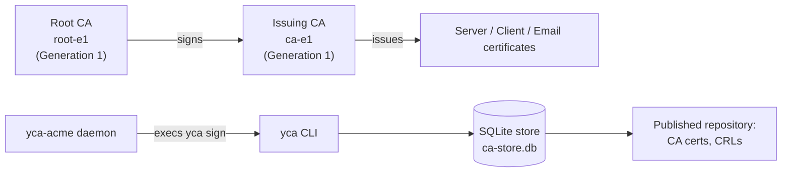

# yca - a private CA

yca is a X.509 certificate authority consisting of a command line tool
and a separate daemon for ACME issuance on top of it. It has a two-tier
hierarchy, one root and one issuing ca per *purpose* (`[ca.tls]` or
`[ca.email]`), each having the EE profiles it is allowed to issue.


```mermaid
flowchart LR
    R["Root CA<br/>root-e1<br/>(Generation 1)" ] -->|signs| S["Issuing CA<br/>ca-e1<br/>(Generation 1)"]
    S -->|issues| EE[Server / Client / Email certificates]
    CLI[yca CLI] --> ST[(SQLite store<br/>ca-store.db)]
    ACME[yca-acme daemon] -->|execs yca sign| CLI
    ST --> PUB[Published repository:<br/>CA certs, CRLs]
```

## Limitations

- **ECDSA only.** Known curves and digests: `secp256r1`, `secp384r1`,
  `secp521r1`, `SHA-256`, `SHA-384`, `SHA-512` (verbatim Botan names
  only).
- **Narrow HSM support.** The `PKCS#11` key backend is tested against
  SoftHSM2 and the Nitrokey HSM 2 via OpenSC only.
- **Fixed subject DN structure.** Every DN is encoded `C`, `O`, `CN` in
  that order (from `country_code`, `org_name` and the certificate's own
  common name); no other attributes (OU, L, ST, serialNumber) can be
  added.
- **TLS and S/MIME profiles.** `server`, `client` and `email`, which is
  what fits within Botan offer: the Code Signing BR leave no extendedKeyUsage
  that a code signing CA can carry and Botan will still sign with, so
  code signing and document signing are not issued.
- **Name constraints are `dNSName` and `rfc822Name` only.** An issuing CA
  can be bounded by `permitted_dns` and `permitted_email`, but not by
  `directoryName`, which the S/MIME BR also require of a technically
  constrained CA. Excluded subtrees are not supported.
- **CRL-only revocation.** No OCSP responder; status is served by the
  published issuing and root CRLs, re-signed on timers.
- **No root rotation or cross-signing.** Issuing CAs rotates, the root
  does not.
- **Private key escrow on disk.** `create` saves the unencrypted private
  key on disk.

## Configuration
Default configuration file is `./yca.toml` and can be overridden with `--config`.

`[pki]`

| Key               | Description                                                                                                   |
| ----------------- | ------------------------------------------------------------------------------------------------------------- |
| `org_name`        | Organization name (`O`)                                                                                       |
| `country_code`    | Two letter country code (`C`)                                                                                 |
| `repository_host` | host serving the published artifacts; used to build the CDP and AIA (caIssuers) URLs in certificates          |

`[pkcs11]`, present only when a CA holds its key on a token

| Key           | Description                 |
| ------------- | --------------------------- |
| `module`      | the PKCS#11 provider module |
| `token_label` | default token label         |

Shared by `[root]` and `[ca.<purpose>]`

| Key           | Description                                                                                |
| ------------- | ------------------------------------------------------------------------------------------ |
| `cn`          | CA display name (`CN`)                                                                     |
| `curve`       | CA key curve                                                                               |
| `digest`      | CA signature digest                                                                        |
| `valid_days`  | CA certificate validity                                                                    |
| `slug_prefix` | file/URL identifier; the slug is `<slug_prefix><generation>` (`<generation>` is 1 at init) |
| `key_backend` | `internal` (default: software key, passphrase-encrypted in the store) or `pkcs11`          |
| `token_label` | this CA's token; only with `key_backend = "pkcs11"`, defaults to `[pkcs11] token_label`    |

`[ca.<purpose>]` adds

| Key               | Description                                                                                                                                              |
| ----------------- | -------------------------------------------------------------------------------------------------------------------------------------------------------- |
| `profiles`        | the EE profiles this CA issues, from `server`, `client`, `email`                                                                                         |
| `ee_curve`        | EE key curve                                                                                                                                             |
| `ee_digest`       | EE signature digest                                                                                                                                      |
| `ee_valid_days`   | default and ceiling for EE validity under this CA; capped to 398 for `server`/`client`, and to 825 for `email`                                           |
| `simple_dn`       | optional, default `false`; `true` reduces the subject DN to the bare `CN`.                                                                               |
| `permitted_dns`   | optional `nameConstraints` permitted subtrees, as bare FQDNs; `example.ca` also covers `www.example.ca`                                                  |
| `permitted_email` | optional `nameConstraints` permitted subtrees, as FQDNs; `example.ca` means every mailbox at that host, `.example.ca` every mailbox in a subdomain of it |
| `policies`        | optional `{ <profile> = [OIDs] }`: the CertificatePolicies OIDs each profile's certificates carry, verbatim; only for profiles listed in `profiles`      |

Constraints:

- Every key that is neither optional nor defaulted is required and
  non-empty; unknown keys and sections are refused by `init` and `add`.
- At least one `[ca.<purpose>]`; a purpose is lowercase `[a-z0-9.-]` and
  not `root`.
- `country_code` is two letters; `repository_host` is a DNS host name (no
  underscores), with no scheme or path.
- Curves and digests come from the sets in [Limitations](#limitations).
- Slug prefixes are lowercase `[a-z0-9.-]`; slug prefixes and CNs are
  unique across all CAs, and no two prefixes differ only by digits.
- `valid_days` and `ee_valid_days` are positive; `ee_valid_days` is below
  the CA's `valid_days` and at most the strictest ceiling of its profiles;
  every CA's `valid_days` is below the root's.
- `profiles` lists at least one known profile, and each profile is
  claimed by exactly one CA.
- `permitted_dns` / `permitted_email`, when present, list at least one DNS
  host name; a `permitted_email` entry is a domain, never a mailbox.
- `policies` keys are profiles the CA lists; each OID is valid, not
  `anyPolicy`, and not repeated.
- `simple_dn = true` is refused on a CA listing `email`.
- `token_label` is at most 32 bytes; the key backend rules are under
  [Key backend layouts](#key-backend-layouts).

Issuance picks the issuer by profile: `create server` routes to whichever
CA lists `server`. A profile no CA claims it means this PKI does not issue
it, and issuance says so.
`email` is CSR-only, see
[S/MIME certificates](docs/operation.md#smime-certificates-the-email-profile).

A CA carries the EKUs of the profiles it lists. A CA listing `email` also
carries `clientAuth`, which the S/MIME Baseline Requirements permit on a
subordinate CA (7.1.2.2) and some public S/MIME intermediates ship; the leaf
still carries `emailProtection` alone.

Policy OIDs are taken as written: any arc, any depth, several per
profile. A profile without an entry, or with an empty list, gets no
CertificatePolicies extension. The CA's own certificate includes the union
of the policies of the profiles it lists, so every policy a leaf asserts
is included by its issuer. The root carries no policies.

`simple_dn` does not apply to the CA's own certificate.

Slug prefixes: the stable part of the CA slugs (file/URL names, PKCS#11 
key labels). The full slug is `<slug_prefix>1` at init; signing CA rotation
increments its generation.

Each section is snapshotted into the store when it is materialized (at
`yca init`, or at `add signing-ca` for a `[ca.<purpose>]` declared
later), and the snapshot becomes the definitive reference: its fields are
locked, later edits to `yca.toml` are warned and ignored, and changing
them means re-initializing. The snapshot follows the sections:
`ca_config` holds `[pki]`, `[pkcs11]` and `[root]` under dotted keys,
`ca_purpose` holds one row per issuing CA.

### Default configuration

```toml
[pki]
org_name = "Example 会社"
country_code = "CA"
repository_host = "pki.example.ca"

[root]
cn = "ETS Root E1"
curve = "secp384r1"
digest = "SHA-384"
valid_days = 7164
slug_prefix = "root-e"

[ca.tls]
profiles = ["server", "client"]
cn = "CA E1"
curve = "secp384r1"
digest = "SHA-384"
valid_days = 1194
slug_prefix = "ca-e"
ee_curve = "secp256r1"
ee_digest = "SHA-256"
ee_valid_days = 398
simple_dn = true
```

The example `policies` OIDs in `yca.toml` use `1.3.6.1.4.1.32473`, the
IANA documentation PEN (RFC 5612); replace them before initialization.

### Key backend layouts

Where the CA keys live:

- **Internal**: every key encrypted in the store.
- **Single token**: every CA key on one token.
- **Split token**: the root key on its own token, the issuing CA keys on a
  second one.
- **Hybrid token**: the root key on a token, the issuing CA keys in the store.

Token labels (`ets`, `ets-root`, `ets-ca`) are examples: the label each
token was initialized with. Keys on a token are labeled by CA slug
(`root-e1`, `ca-e1`): at init an existing keypair with that label is
adopted (curve-checked), and a missing one is generated under it.

| Key                    | Internal              | Single token | Split token                     | Hybrid token                            |
| ---------------------- | --------------------- | ------------ | ------------------------------- | --------------------------------------- |
| `[root] key_backend`   | `internal` (default)  | `pkcs11`     | `pkcs11`                        | `pkcs11`                                |
| `[root] token_label`   | absent                | absent       | `"ets-root"`                    | `"ets-root"`                            |
| `[ca.*] key_backend`   | `internal` (default)  | `pkcs11`     | `pkcs11`                        | `internal` (default)                    |
| `[ca.*] token_label`   | absent                | absent       | `"ets-ca"`                      | absent                                  |
| `[pkcs11] module`      | absent                | required     | required                        | required                                |
| `[pkcs11] token_label` | absent                | `"ets"`      | absent                          | absent                                  |
| Secrets                | `CA_STORE_PASSPHRASE` | `CA_HSM_PIN` | `CA_HSM_ROOT_PIN`, `CA_HSM_PIN` | `CA_HSM_ROOT_PIN`, `CA_STORE_PASSPHRASE` |

`key_backend` is chosen per CA. yca rejects a `pkcs11` issuing CA under
an `internal` root (it would protect the replaceable key better than the
anchor), `[pkcs11]` when no CA uses the `pkcs11` backend, a CA's
`token_label` when its backend is `internal`, and `[pkcs11] token_label`
when every token-held CA declares a label of its own; a token-held CA
with neither is rejected too.

If `CA_HSM_ROOT_PIN` is unset, it falls back to `CA_HSM_PIN`.

#### Single token layout

```toml
[root]
key_backend = "pkcs11"

[ca.tls]
key_backend = "pkcs11"

[pkcs11]
module = "/usr/lib/opensc-pkcs11.so"
token_label = "ets"
```

#### Split token layout

```toml
[root]
key_backend = "pkcs11"
token_label = "ets-root"

[ca.tls]
key_backend = "pkcs11"
token_label = "ets-ca"

[pkcs11]
module = "/usr/lib/opensc-pkcs11.so"
```

#### Hybrid layout

```toml
[root]
key_backend = "pkcs11"
token_label = "ets-root"

[pkcs11]
module = "/usr/lib/opensc-pkcs11.so"
```

## CLI

```
yca [--config PATH] [--store DIR] <action> <target> [options]
```

Global options: `--config` (default `./yca.toml`), `--store` (default
`./store`), `--version`. Secrets come from the environment, see
[Key backend layouts](#key-backend-layouts). An operation needs only the
secrets of the CA keys it touches.

In the distribution packages, `yca` on `PATH` is an operator wrapper: it
runs the CLI as the `yca` service account with the packaged config and
store as defaults and the unattended secrets from `/etc/yca/yca.env`
(see `yca(1)` and [installation](docs/install.md)).

| Command | Purpose |
|---------|---------|
| `init` | initialize the PKI: the root plus every declared `[ca.<purpose>]`. A passphrase is generated and shown once if `CA_STORE_PASSPHRASE` is unset. Fails if already initialized. |
| `add signing-ca --purpose <p>` | create an issuing CA the config declares but the store does not hold. |
| `create <server\|client> --cn <cn> [--san type:name ...] [--valid <N><s\|m\|h\|d>]` | issue an EE cert with a locally generated key, delivered under `ee/`. `server` always includes `DNS:CN`; `client` requires at least one `--san`. |
| `enroll --id <id>` | enroll an identity (e.g. an email) for CSR signing |
| `get nonce --id <id>` | issue/return the identity's single-use nonce (5 minutes, idempotent while fresh) |
| `sign <server\|client\|email> --id <id> --nonce <n> --csr <pem\|-\|path> [--valid ...]` | issue from an external PKCS#10 CSR, gated by the `(id, nonce)` pair. Only the public key (must be ECDSA on `ee_curve`), subject CN and supported SANs are taken from the CSR. Writes nothing under `ee/`; prints the CN so it pipes into `get`. |
| `revoke <server\|client\|email\|ca> [--cn <cn> \| --serial <hex>] [--reason <CRLReason>]` | revoke the newest active cert by CN, or the exact one by serial; the entry goes on the CRL of the issuing generation. `revoke ca` revokes a signing CA generation by `--cn` onto the root CRL (refused for the active issuer; `renew signing-ca` first). |
| `renew signing-ca [--purpose <p>] --new-cn <cn>` | rotate one issuing CA: the successor generation issues from then on, the predecessor keeps publishing its CRL. Other purposes are untouched. `--purpose` is required once several issuing CAs exist. |
| `refresh crl [root\|signing\|all]` | re-sign the published CRLs: same unexpired entries, crlNumber+1, fresh dates; expired entries are pruned per RFC 5280 3.3. Covers every live generation of the scope. |
| `get <server\|client\|email\|ca\|crl\|config\|nonce> [--cn <cn>] [--id <id>] [--encoding pem\|der] [--chain]` | export to stdout. `ca`/`crl` take `--cn root-ca\|<purpose>-ca` (or a generation CN); `signing-ca` works while exactly one issuing CA exists; `--cn -` reads the CN from stdin. `--chain` appends the issuers, nearest first, stopping below the self-signed root that relying parties already hold; any EE profile or `ca`, and PEM only. |
| `list <filter> [--tsv] [--limit N]` | one filter of `--expiring [N]`, `--expired [N]`, `--revoked [N]`, `--last [N]` (window in days) or `--cn <cn>`. |

`--valid` requests a shorter validity for one issuance in range
`[5m, ee_valid_days]`; the locked policy is the default and the ceiling.

Examples:

```
yca create server --cn server.example.ca --san dns:alt.example.ca
yca enroll --id user@example.ca
yca sign server --id user@example.ca \
    --nonce $(yca get nonce --id user@example.ca) --csr - < server.csr | \
    yca get server --cn -
yca revoke server --cn server.example.ca --reason superseded
yca get ca --cn root-ca --encoding der
yca get crl --cn signing-ca --encoding der
yca list --expiring 30
```

The server certificate issued above, under the example configuration
(`yca get server --cn server.example.ca | openssl x509 -text -noout`,
key and signature bytes elided):

```console
Certificate:
    Data:
        Version: 3 (0x2)
        Serial Number:
            6c:59:88:cc:27:d4:ee:6b:22:ff:5f:94:e6:d0:d0:87
        Signature Algorithm: ecdsa-with-SHA256
        Issuer: C=CA, O=Example 会社, CN=CA E1
        Validity
            Not Before: Sep 25 07:18:11 2026 GMT
            Not After : Oct 28 07:18:11 2027 GMT
        Subject: CN=server.example.ca
        Subject Public Key Info:
            Public Key Algorithm: id-ecPublicKey
                Public-Key: (256 bit)
                pub:
                    04:...
                ASN1 OID: prime256v1
                NIST CURVE: P-256
        X509v3 extensions:
            Authority Information Access:
                CA Issuers - URI:http://pki.example.ca/ca-e1.crt
            X509v3 Subject Key Identifier:
                AA:2B:4E:AF:C5:79:F8:39:79:DE:68:85:D2:23:71:28:47:9C:9A:2D:8E:29:B9:A0
            X509v3 Key Usage: critical
                Digital Signature
            X509v3 Subject Alternative Name:
                DNS:alt.example.ca, DNS:server.example.ca
            X509v3 Basic Constraints: critical
                CA:FALSE
            X509v3 CRL Distribution Points:
                Full Name:
                  URI:http://pki.example.ca/ca-e1.crl

            X509v3 Certificate Policies:
                Policy: 1.3.6.1.4.1.32473.1.1
            X509v3 Authority Key Identifier:
                6B:FB:BC:C4:1A:1A:F7:E9:82:A1:D1:D8:14:51:FC:D3:BF:53:F8:C1:70:0F:CA:AD
            X509v3 Extended Key Usage:
                TLS Web Server Authentication
    Signature Algorithm: ecdsa-with-SHA256
    Signature Value:
        ...
```

## Operations

- **Install.** Packages for Debian, Fedora, Arch, FreeBSD, and a Gentoo
  overlay.
- **Issuance.** Either `create` or the CSR pipeline; servers can use ACME.
- **Revocation and CRLs.** `revoke`, then the CRLs do the rest. Two
  cadences, each on its own systemd timer: the signing CRL performs
  re-publication within 7 days (refreshed daily), the root CRL within
  183 days (refreshed quarterly).
- **Publication.** A timer rsyncs `store/ca/` (CA certs `.crt`, CRLs
  `.crl`) to the web root served at `repository_host`; the CDP and
  caIssuers URLs in issued certificates point there.
- **Rotation.** `renew signing-ca --purpose <p>` for one issuing CA.
- **ACME.** `yca-acme` exposes RFC 8555 issuance for the server profile:
  EAB-gated accounts, http-01 and dns-01 (wildcards included), revokeCert,
  ARI (RFC 9773). It owns only protocol state and execs the `yca` CLI to
  sign; verified with acme.sh and certbot.

## Documentation

- [Installation](docs/install.md) - installation, the init ceremony,
  timers, publication and nginx, FreeBSD.
- [CA operation](docs/operation.md) - day-to-day usage: issuance
  (with and without a CSR), S/MIME, retrieval, listing, revocation,
  adding and rotating issuing CAs.
- [ACME operation](docs/acme-operation.md) - the `yca-acme`
  frontend: TLS bootstrap, the daemon and its unit, EAB, clients, dns-01,
  day-2 operations.

## License

Copyright 2026 p7cq. Licensed under the Apache License, Version 2.0,
see [license](LICENSE).

Vendored and module dependencies are under their own permissive licenses
(BSD, MIT, public domain), see
[Third-party notices](THIRD_PARTY_NOTICES.md).
