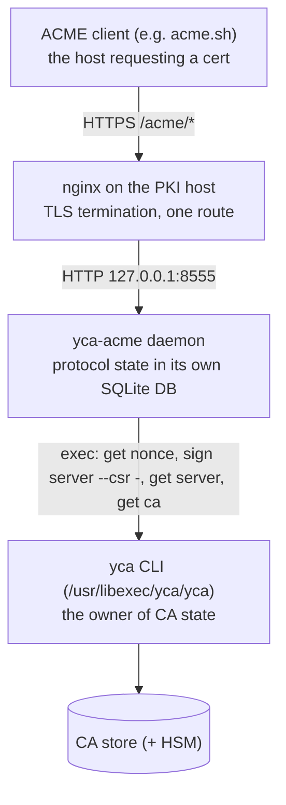
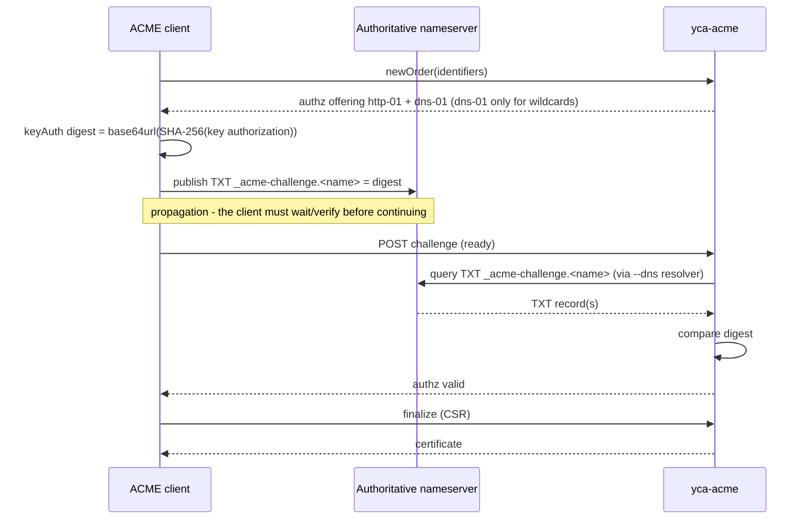

# yca-acme - configuration & operations

What to provision, how to run it under systemd behind nginx, how clients
enroll, and what day-2 operations look like.

## Moving parts



- The daemon never opens the CA store. Every issuance execs the `yca`
  binary, so the store contract, locking, audit log and the renewal-window
  policy apply unchanged.
- Protocol state (accounts, EAB credentials, orders, challenges, issued
  chains) lives in the daemon's own database (`--state`), not in the CA store.
- Like `yca`, the `yca-acme` on `PATH` is an operator wrapper; the daemon
  itself is `/usr/libexec/yca/yca-acme`, which the unit starts directly.
  The wrapper runs the `eab` and `ari` subcommands as the service account
  (the database is `yca:yca` 0600), with umask 077 and `--state
  /var/lib/yca/acme.db` unless given; they need no CA secret, so none is
  passed on. Anything else runs the real binary unchanged.
- http-01 validation is outbound from the daemon: it fetches
  `http://<identifier>/.well-known/acme-challenge/<token>` - identifiers
  must resolve (internal DNS) from the PKI host's point of view.

## Prerequisites

1. An initialized yca store, reachable via `--config`/`--store`.
2. The enrolled frontend identity (one-time ceremony):

   ```bash
   yca enroll --id acme
   ```

3. The CA secret in the daemon's environment: `finalize` signs, so
   `CA_HSM_PIN` (pkcs11) or `CA_STORE_PASSPHRASE` (internal) must be set -
   the same automation-vs-ceremony trade the CRL refresh timers document.
   The unit reads the same root-only `/etc/yca/yca.env`.
4. A TLS certificate for the ACME endpoint itself (bootstrap ceremony, see
   next section).
5. DNS: the endpoint name (e.g. `pki.example.ca`) and every identifier
   clients will order must resolve in the environment's DNS.

ACME client on Fedora:
```bash
sudo curl https://get.acme.sh | sh -s email=so@example.ca --home /usr/local/share/acme --config-home /usr/local/share/acme --cert-home /usr/local/share/acme
```

## TLS bootstrap (chicken and egg, resolved by ceremony)

RFC 8555 requires HTTPS, and the endpoint's own certificate comes from the
CA behind it. Issue it manually, once:

```bash
yca create server --cn pki.example.ca
yca get ca --cn root-ca > root.pem        # distribute to clients
```

Clients must trust the private root explicitly (`--ca-bundle root.pem` for
acme.sh, `REQUESTS_CA_BUNDLE=root.pem` for certbot).

Renewing the endpoint certificate manually works the same way. For an
automated setup where `yca-acme` issues and renews its own endpoint
certificate via ACME against itself (dns-01 - the endpoint is not
reachable for http-01 until nginx is already serving it), see
"Automated renewal" below. Either way the CA's renewal window applies: an
order succeeds only once the active endpoint cert has less than 33% of
its lifetime left, which is exactly when you should be renewing anyway.

**CN vs SAN caveat**: uniqueness is keyed on (CN, profile), but TLS
identity lives in the SANs - modern verifiers ignore the CN entirely. If a
non-ACME certificate already exists whose **CN equals** an identifier a
client will order, the ACME order is refused until that cert enters the
renewal window. When you need a hand-issued cert to *cover* a name that
ACME will also serve, give it a different CN and put the shared name in a
SAN (`create server --cn other-cn --san dns:shared-name`).

### Automated renewal for yca's ACME TLS certificate

This only works if the DNS server is already configured to accept `dns-01`
challenges for the `repository_host` domain name.

#### 1. Initialize the store

```bash
yca init
```

#### 2. Trust the root

```bash
yca get ca --cn root-ca | sudo tee /etc/ssl/certs/ETS_Root_E1.pem
```

Add the anchor to the system trust store. On Arch Linux (and Fedora; commands
are OS specific):

```bash
sudo trust anchor --store /etc/ssl/certs/ETS_Root_E1.pem
sudo update-ca-trust
```

```bash
sudo trust list | head -3
```

#### 3. Configure nginx

`/etc/yca` and `/srv/yca` (with `pub/` and the http-01 `webroot/`) come
with the package. The acme.sh home and the
endpoint certificate live under `/etc/yca/acme`, root-only (acme.sh and
nginx run as root there):

```bash
sudo install -d -m 700 /etc/yca/acme
```

Install the example server block as in
[Installation, section 6](install.md#6-repository-host-publication-and-reverse-proxy),
this time with its HTTPS block.

#### 4. Bootstrap a short-lived certificate

Manually issue a short-lived certificate for `repository_host` then copy
the certificate and key to the location set in the NGINX (`yca.conf`). The
certificate must hold validity until `acme.sh --issue` below is 
finalized. The CN must match the identifier used in every later step - it
is used both here and by `acme.sh` (assuming `hostname` resolves to
`pki.example.ca`):

```bash
yca create server --cn $(hostname) --valid 15m

yca get server --cn $(hostname) --chain | \
  sudo tee /etc/yca/acme/fullchain.pem > /dev/null
sudo install -m 600 /var/lib/yca/store/ee/$(hostname).key /etc/yca/acme/key.pem
sudo chmod 600 /etc/yca/acme/fullchain.pem

sudo systemctl restart nginx.service
```

#### 5. Enroll the ACME identity and provision an EAB credential

```bash
yca enroll --id acme
yca-acme eab new --allow $(hostname)
```

`eab new` prints the kid and HMAC once - save them where the
`--register-account` step below reads them from:

```bash
echo -n '<kid printed above>'  | sudo tee /etc/yca/acme/.kid
echo -n '<hmac printed above>' | sudo tee /etc/yca/acme/.hmac
sudo chmod 600 /etc/yca/acme/.{kid,hmac}
```

#### 6. Configure and start the daemon

Override the unit's `ExecStart` with the public URL, the desired validity
and the target DNS server (`sudo systemctl edit yca-acme.service`, which
also reloads systemd). For example:

```systemd
[Service]
ExecStart=
ExecStart=/usr/libexec/yca/yca-acme \
  --state /var/lib/yca/acme.db \
  --listen 127.0.0.1:8555 \
  --url https://pki.example.ca \
  --yca /usr/libexec/yca/yca \
  --config /etc/yca/yca.toml \
  --store /var/lib/yca/store \
  --dns ns1.example.ca \
  --valid 47d
```

Environment variables `NSUPDATE_SERVER`, `NSUPDATE_KEY`, `NSUPDATE_ZONE` should
also be set (e.g., in `/root/.bashrc`):

```bash
export NSUPDATE_SERVER=ns1.example.ca
export NSUPDATE_KEY=/etc/yca/nsupdate.key
export NSUPDATE_ZONE=_acme-challenge.pki.example.ca
```

```bash
sudo systemctl enable yca-acme.service yca-crl-refresh.timer yca-root-crl-refresh.timer yca-publish.timer --now
```

#### 7. Register the acme.sh account

Use a new `--home`/`--config-home` if `acme.sh` will issue multiple
certificates on the *same* host.

```bash
export ACME=https://pki.example.ca/acme/directory

sudo acme.sh \
--home /etc/yca/acme \
--config-home /etc/yca/acme \
--server $ACME \
--register-account \
--eab-kid $(cat /etc/yca/acme/.kid) \
--eab-hmac-key $(cat /etc/yca/acme/.hmac)
```

#### 8. Issue and install the certificate

Note that the `nsupdate` command (used by `dns_nsupdate` hook) must be
available in PATH.

```bash
sudo acme.sh \
--home /etc/yca/acme \
--config-home /etc/yca/acme \
--issue \
--server $ACME \
-d $(hostname) \
--dns dns_nsupdate --dnssleep 5 \
--fullchain-file /etc/yca/acme/fullchain.pem \
--key-file /etc/yca/acme/key.pem \
--reloadcmd 'systemctl reload nginx'

# FreeBSD: paths under /usr/local/etc, nginx reloaded through service(8)
sudo acme.sh \
--home /usr/local/etc/yca/acme \
--config-home /usr/local/etc/yca/acme \
--issue \
--server $ACME \
-d $(hostname) \
--dns dns_nsupdate --dnssleep 5 \
--fullchain-file /usr/local/etc/yca/acme/fullchain.pem \
--key-file /usr/local/etc/yca/acme/key.pem \
--reloadcmd 'service nginx reload'
```

#### 9. Enable the renewal timer

```bash
sudo systemctl enable yca-acme-renew.timer --now
```

## The daemon

```
yca-acme [flags]

--state       protocol state database. An explicit path creates it if
              missing; without --state, only the conventional ./acme.db
              is opened, and only if it already exists.
--listen      bind address (default 127.0.0.1:8555)
--url         EXTERNAL base URL (e.g. https://pki.example.ca) - what
              clients see. Every URL in the directory is built from it,
              and every JWS binds the request URL against it. The most
              common misconfiguration behind a proxy - see the systemd
              section for the symptoms.
--yca         path to the yca binary (default: yca on PATH, the operator
              wrapper, which runs the CLI directly when invoked as yca;
              the unit passes /usr/libexec/yca/yca)
--config      passed through to yca --config
--store       passed through to yca --store
--id          enrolled identity used for signing (default acme)
--valid       validity requested per issuance, passed to `yca sign --valid`
              (e.g. 90d). The CA validates it: [5m, ee_valid_days], the
              locked policy being the ceiling. Empty (default): the CA
              issues at its ee_valid_days policy. This is the lever for
              short ACME certificates without touching the CA config -
              set it in the systemd unit and restart the daemon.
--http01-port port the validator connects to on identifiers (default 80)
--dns         resolver for dns-01 TXT lookups, host[:53] - point it at the
              bind serving the identifier zones (default: system resolver)
--tls-cert    serve TLS directly (file may hold the full chain)
--tls-key     TLS private key
--version     print version and exit

yca-acme eab new  [--state db] [--allow patterns]   provision a credential
yca-acme eab list [--state db]                      list credentials
yca-acme eab delete [--state db] <kid>              revoke a credential
yca-acme ari accelerate --issuer <cn> [--window d]  replace that issuer's
                                                    certificates at once
yca-acme ari list                                   active accelerations
yca-acme ari clear --issuer <cn>                    back to the policy window
```

Behind nginx, leave `--tls-cert` unset (plain HTTP on loopback) and let
nginx terminate TLS; `--tls-cert/key` exists for tests and for running
without a proxy.

### State database

`acme.db` holds accounts (public JWKs), EAB credentials (kid + HMAC key +
allow patterns), orders/authorizations/challenges, and the issued PEM
chains. Keep it mode 0600, owned by the service user. Losing it does NOT
affect the CA: issued certificates live in the store; clients simply
re-register (new EAB credentials must be provisioned). Back it up with the
same cadence as the store if re-enrollment churn matters to you.

Without `--state`, the real `yca-acme` only opens `./acme.db` if it
already exists in the current directory; it does not create one
silently. The operator wrapper supplies `--state /var/lib/yca/acme.db`
to `eab` and `ari`, so `yca-acme eab list` reaches the running daemon's
database; pass `--state` only if the unit uses another one.

## systemd

The unit ships as `share/systemd/yca-acme.service` (installed, not
enabled, by the packages; `--url` carries a placeholder - see below).
It is the one long-running yca service, with the CA secret and write
access the exec pipeline needs:

```ini
[Unit]
Description=yca ACME issuance frontend (RFC 8555)
After=network.target

[Service]
User=yca
Group=yca
# CA_HSM_PIN=... or CA_STORE_PASSPHRASE=... - root-owned, mode 0600.
EnvironmentFile=/etc/yca/yca.env
ExecStart=/usr/libexec/yca/yca-acme \
  --state /var/lib/yca/acme.db \
  --listen 127.0.0.1:8555 \
  --url https://pki.example.ca \
  --yca /usr/libexec/yca/yca \
  --config /etc/yca/yca.toml \
  --store /var/lib/yca/store
Restart=on-failure

# Hardening, mirroring the yca-* oneshot units. The daemon needs the whole state
# dir read-write: the store (issuance), yca.log next to it, and acme.db.
# pkcs11 backend additionally needs AF_UNIX (pcscd) - AF_INET/AF_INET6 are
# for the listener and the outbound http-01 fetches.
UMask=0077
NoNewPrivileges=yes
ProtectSystem=strict
ReadWritePaths=/var/lib/yca
ProtectHome=yes
PrivateTmp=yes
PrivateDevices=yes
ProtectClock=yes
ProtectControlGroups=yes
ProtectKernelLogs=yes
ProtectKernelModules=yes
ProtectKernelTunables=yes
ProtectProc=invisible
RestrictAddressFamilies=AF_UNIX AF_INET AF_INET6
RestrictNamespaces=yes
RestrictRealtime=yes
RestrictSUIDSGID=yes
LockPersonality=yes
MemoryDenyWriteExecute=yes
CapabilityBoundingSet=
SystemCallArchitectures=native
SystemCallFilter=@system-service
SystemCallErrorNumber=EPERM

[Install]
WantedBy=multi-user.target
```

Override the shipped placeholder `--url https://pki.example.ca` with
the real `repository_host` set in `yca.toml` BEFORE the first client
connects:

```bash
# systemctl edit yca-acme
```

```ini
[Service]
ExecStart=
ExecStart=/usr/libexec/yca/yca-acme \
  --state /var/lib/yca/acme.db \
  --listen 127.0.0.1:8555 \
  --url https://pki.example.ca \
  --yca /usr/libexec/yca/yca \
  --config /etc/yca/yca.toml \
  --store /var/lib/yca/store
```

Enable it like the rotation timer: only after `/etc/yca/yca.env` exists
(the enable is the operator's explicit decision to automate the secret).

```bash
# systemctl daemon-reload
# systemctl enable --now yca-acme
# curl -s https://pki.example.ca/acme/directory   # smoke: the URLs inside
#                                                   must carry the public host
```

## nginx

`share/nginx/yca.conf` carries the full picture: the plain-HTTP block
(published .crt/.crl, an http-01 webroot under `/.well-known/acme-challenge/`)
plus the HTTPS block below. TLS termination at nginx with the bootstrap
certificate; the daemon stays on loopback HTTP:

```nginx
server {
    listen 443 ssl;
    server_name pki.example.ca;
    ssl_certificate     /etc/yca/acme/fullchain.pem;  # EE+signing
    ssl_certificate_key /etc/yca/acme/key.pem;

    location /acme/ {
        # No URI part on proxy_pass: the path reaches the daemon verbatim,
        # matching the JWS url binding.
        proxy_pass http://127.0.0.1:8555;
    }
}
```

`--url` must be exactly `https://pki.example.ca` (scheme + host clients
use, no trailing slash). The `.crt`/`.crl` publication stays on
the existing plain-HTTP server block - CRL/AIA fetchers do not need (and
some refuse) TLS there.

## EAB lifecycle

No open registration: every account needs a provisioned credential.

```bash
yca-acme eab new --allow 'pki.example.ca'

┌ EAB credential (shown once) ────────────────────────┐
    KID: SXYGc6ccV4D0DX_b4rkTk3w
   HMAC: mfHzIkCGmmmJva_fXK0ybcg2N1KzdfY4uQYeEL-73Gs
  Allow: pki.example.ca
└─────────────────────────────────────────────────────┘

```

- The HMAC is displayed once - hand it to the client operator over a safe
  channel. `eab list` shows kids and policies, never keys.
- `--allow` is the account's identifier policy: comma-separated patterns,
  each an exact name (`pki.example.ca`) or a wildcard suffix
  (`*.example.ca` - any depth below the suffix, not the bare suffix).
  Empty = any name. Orders outside the policy fail with
  `rejectedIdentifier`.
- One credential per team/host class is a sensible granularity: the kid is
  recorded on the account and appears in the daemon log at registration.
- Revoking a credential: `eab delete <kid>`. Accounts registered with it
  keep existing (and keep authenticating) but can no longer order
  anything - their identifier policy is gone. The command names the
  affected accounts.
- Changing an account's policy: there is no rebind. Provision a new
  credential, then have the client register a **fresh account key** with
  it - re-registering an existing key returns the existing account with
  its old binding (RFC 8555 7.3), silently. The clean sequence on the
  client: `acme.sh --deactivate-account`, remove the client's local
  account state, register again with the new kid/HMAC.

`yca-acme` has a rigid argument structure: the subcommand must precede
its arguments, `eab new` before `--state`. Flags placed before the
subcommand are refused with a usage error rather than falling through to
the daemon (which would otherwise try and fail to bind the listen
address a second time).

## Client configuration

### acme.sh

As root:

```bash
export ACME=https://pki.example.ca/acme/directory
acme.sh --register-account --server "$ACME" --ca-bundle root.pem \
      --eab-kid <kid> --eab-hmac-key <hmac>
acme.sh --issue --server "$ACME" --ca-bundle root.pem \
      -d host.example.ca --standalone             # or --webroot <dir>
acme.sh --install-cert -d host.example.ca \
      --fullchain-file /etc/ssl/host.pem --key-file /etc/ssl/host.key \
      --reloadcmd 'systemctl reload nginx'
```

- `acme.sh` allows only one account active at any time.
- `--standalone` needs socat and binds :80; `--webroot` serves the token
  from an existing web server's docroot.
- **Renewal cadence must fit the CA's renewal window** - see the table
  below and set `--days` accordingly at issue time.
- `--ca-bundle` takes precedence over the system trust; this flag can be
  omitted when `root.pem` is trusted system-wide.

### certbot (verified with 5.6.0)

As root:

```bash
export ACME=https://pki.example.ca/acme/directory
REQUESTS_CA_BUNDLE=root.pem certbot certonly \
      --server "$ACME" \
      --eab-kid <kid> --eab-hmac-key <hmac> \
      --standalone -d host.example.ca
REQUESTS_CA_BUNDLE=root.pem certbot revoke \
      --cert-path .../cert.pem --reason keycompromise \
      --server "$ACME"
```

certbot sends CN-less (SAN-only) CSRs; the CA derives the leaf CN from the
first dns SAN (`CSR has no subject CN; using dns SAN ... as the CN` in
yca.log). Registration, http-01 issuance and revocation are all verified.

### dns-01 and wildcards

See [dns-01 challenges](#dns-01-challenges) below for the full walkthrough
(manual and automated).

### Accelerating renewal after a CA compromise

`renewalInfo` normally mirrors the CA's policy window (open at 33% of the
lifetime remaining, closed at 10%). Two things override it and tell a
client to replace **now**, with a window that is already open:

- the certificate is revoked (the frontend records the revocations it
  performs; one revoked through the CLI or by revoking its issuing CA is
  not visible here, which is what the directive below is for);
- an operator accelerated its issuer, after revoking that CA generation:

```bash
yca revoke ca --cn "CA E1" --reason cACompromise   # on the CA
yca-acme ari accelerate --issuer "CA E1" --window 2h
yca-acme ari list
```

Clients pick a uniformly random moment inside the window (RFC 9773
4.2), which is what keeps the fleet from arriving together - issuance
is serialized behind one CA, and one PKCS#11 login per issuance means a
100-certificate fleet needs on the order of a quarter hour of signing no
matter how fast the clients ask. Size `--window` accordingly. While a
directive is active the `Retry-After` hint drops to [10m, 1h] so clients
notice quickly (RFC 9773 4.3.1 makes this the server's lever).

The directive is self-limiting: a replaced certificate is signed by the
successor generation, so it stops matching. `ari clear` cancels it early.

### Renewal cadence vs the CA's renewal window

The CA refuses a successor while the active certificate still has more
than 33% of its lifetime left (`app::renew_window_pct`). **ARI-capable
clients need no configuration**: the server publishes `renewalInfo`
(RFC 9773) and suggests exactly the window the CA will accept (open at
33% remaining, closed at 10%). For clients without ARI support, the
defaults do not know the policy - acme.sh renews at 60 days of age and
certbot 30 days before expiry, both **too early** for long-lived certs
and refused with `serverInternal` at finalize. Align them:

The effective leaf lifetime is the daemon's `--valid` when set, else the
CA's `ee_valid_days`:

| Leaf lifetime  | Earliest renewal age | acme.sh            | certbot (renew_before_expiry) |
|----------------|----------------------|--------------------|-------------------------------|
| 90 (`--valid 90d`) | 61 days          | `--days 61`        | 29 days                       |
| 180            | 121 days             | `--days 121`       | 59 days                       |
| 397 (ee_valid_days default) | 266 days | `--days 266`      | 131 days                      |

(Earliest age = just past 67% of the lifetime. A refused renewal is
harmless - the client retries on its schedule - but a cron that retries a
refused renewal daily for months is noise you can avoid.)

## dns-01 challenges

Any identifier may be validated via dns-01, and it is the only option for
two cases: **wildcards** (`*.zone` validates against the base domain,
never http-01), and any host that cannot answer on port 80 - most
commonly the repository host itself during its own TLS bootstrap/renewal
(see [TLS bootstrap](#tls-bootstrap-chicken-and-egg-resolved-by-ceremony)),
or any identifier behind a firewall that only DNS automation can reach.

The daemon validates by querying `_acme-challenge.<name>` for a TXT
record equal to `base64url(SHA-256(key authorization))`, RFC 8555 8.4.
That query goes out from the daemon's own resolver - `--dns host[:53]`
(default: system resolver). Point it at the zone's authoritative
nameserver whenever the default resolver would not see a record the
instant it is published (split-horizon DNS, slow secondaries, or simply
no route to the zone from the daemon's network).



The EAB `--allow` policy applies to the literal identifier: allow a
wildcard pattern explicitly (`--allow '*.example.ca'`) - it does not
imply the bare suffix, and the bare suffix does not imply it either.

### Manual walkthrough (acme.sh)

Good for a first test, or a zone with no update automation. Two runs of
the **same** `--issue` command: the first only computes and prints the
record and stops without the confirmation flag; the second, re-run with
`--yes-I-know-dns-manual-mode-enough-go-ahead-please` added, validates
and finalizes. Both runs need `-d`/`--dns` again - acme.sh re-derives
the challenge each time, it does not resume from the first run's state.

```bash
# acme.sh --issue --server "$DIR" --ca-bundle root.pem \
      -d host.example.ca --dns
# ... acme.sh prints the TXT name/value, then stops here ...
```

Publish `_acme-challenge.host.example.ca` = the printed value on the
zone's nameserver. **Common pitfall**: a zone file entry without a
trailing dot on the FQDN is relative to the zone's `$ORIGIN` - writing
`_acme-challenge.host.example.ca` (no trailing dot) inside a zone whose
origin is `example.ca.` publishes
`_acme-challenge.host.example.ca.example.ca.` instead, and the intended
name resolves NXDOMAIN.

Verify against the resolver the daemon actually uses (the `--dns`
target, or its system resolver) before continuing - this is the
single most useful diagnostic step:

```bash
$ dig TXT _acme-challenge.host.example.ca @<that resolver>
```

An **authoritative** (`aa` flag set) `NXDOMAIN` means the name does not
exist at all under that nameserver - not just the TXT type (that would
be `NOERROR` with an empty answer section). It almost always means one
of: the zone was not reloaded after the edit, the trailing-dot mistake
above, or the record landed in a different zone file than the one being
served.

Once the record resolves correctly, finalize by re-running the exact
same `--issue` command, with the confirmation flag added:

```bash
# acme.sh --issue --server "$DIR" --ca-bundle root.pem \
      -d host.example.ca --dns \
      --yes-I-know-dns-manual-mode-enough-go-ahead-please
```

Orders and authorizations stay valid 24 h (see Day-2 operations below),
so there is no time pressure between the two runs.

### Automating with nsupdate/TSIG (bind)

acme.sh ships a `dns_nsupdate` hook (RFC 2136 dynamic updates) that
removes the manual step entirely. On the authoritative nameserver:

```bash
# tsig-keygen acme-dns01 > /etc/bind/keys/acme-dns01.key
```

Include the key on the nameserver - but **do not grant it write access
on the zone the identifiers actually live in** if that zone is
DNSSEC-signed by anything other than BIND itself (an offline
`dnssec-signzone` pipeline, a cron job, another tool). Give the
automation its own small, dedicated, unsigned zone instead - one per
identifier that will use dns-01 - named exactly after the challenge:

```
include "/etc/bind/keys/acme-dns01.key";

zone "_acme-challenge.host.example.ca" {
    type master;
    file "/etc/bind/zones/_acme-challenge.host.example.ca";
    update-policy {
        grant acme-dns01 subdomain _acme-challenge.host.example.ca TXT;
    };
};
```

`subdomain` now works cleanly, because the grant is anchored at the
**zone's own apex** rather than at a fixed suffix inside a bigger zone.
That distinction matters: the challenge name is
`_acme-challenge.<identifier>`, so `_acme-challenge` sits in front of a
variable number of labels, not at a fixed suffix. That rules out
`subdomain` scoped to the *parent* zone (it only matches names *below*
a fixed name - it would grant `x._acme-challenge.example.ca`, not
`_acme-challenge.host.example.ca`), and BIND's `wildcard` match type
only accepts `*` as the pattern's leftmost label (`named-checkconf`
rejects `_acme-challenge.*.example.ca` outright: "is not a wildcard"),
so nothing short of a dedicated per-host zone expresses "just this one
challenge name, and nothing else" - which is also exactly the
least-privilege scope you want for an automation credential.

The zone file itself carries no data beyond SOA/NS - TXT records arrive
solely through `nsupdate`, and BIND bumps the SOA serial on every
dynamic update on its own:

```
$TTL 300
@   IN  SOA ns1.example.ca. admin.example.ca. (
                2026010100  ; serial
                300         ; refresh
                300         ; retry
                86400       ; expire
                60 )        ; negative cache TTL
    IN  NS  ns1.example.ca.
```

Short TTLs throughout: this zone exists only to be read once per
issuance, seconds after being written, never cached anywhere.

`rndc reload` to pick it up (`named-checkconf` first). This zone is
**not delegated** from the parent (no NS record for it inside
`example.ca`) - it is an island that only the nameserver hosting it
knows about directly. That is fine for `yca-acme`, which queries a
specific server via `--dns`, but it has two consequences worth planning
for before the first run:

- **`--dnssleep <N>` is required on the acme.sh side.** Without it,
  acme.sh's own pre-flight check queries public resolvers to confirm
  the record is visible before bothering the ACME server - which never
  succeeds for an undelegated zone, and acme.sh loops
  ("Not valid yet, let's wait...") forever. `--dnssleep` skips that
  check and sleeps a fixed number of seconds instead; 5s is ample for a
  same-host dynamic update. It is saved into the domain's conf on first
  use, so `--cron` renewals replay it automatically.
- **Point `yca-acme --dns` (and `NSUPDATE_SERVER`) at the master
  specifically, not at a secondary or the system resolver.** A
  secondary only knows about zones it has a matching `type slave;`
  stanza for; unless you have deliberately configured transfer of this
  new zone to every secondary, only the master answers for it. A
  request that lands on a secondary that has never heard of the zone
  fails as a plain resolution error ("no such host"/NXDOMAIN-shaped),
  easy to mistake for a propagation delay when it is really "wrong
  server entirely."

Copy the generated `key { ... };` block to the client host (mode 0600),
then issue with the hook instead of `--dns`. Pin `NSUPDATE_ZONE`
explicitly - automatic zone-apex detection would otherwise walk up
past this dedicated zone into the parent:

```bash
# NSUPDATE_SERVER=ns1.example.ca NSUPDATE_KEY=/etc/yca/nsupdate.key \
      NSUPDATE_ZONE=_acme-challenge.host.example.ca \
      acme.sh --issue --server "$DIR" --ca-bundle root.pem \
      -d host.example.ca --dns dns_nsupdate --dnssleep 5
```

acme.sh persists `NSUPDATE_*` (and `Le_DNSSleep`) into its own
`account.conf`/domain conf on first use, so subsequent `--cron`
renewals reuse them with no further input. Wildcard issuance follows
the same shape, with a matching EAB `--allow` pattern and its own
dedicated `_acme-challenge.<base>` zone:

```bash
# acme.sh --issue --server "$DIR" --ca-bundle root.pem \
      -d '*.example.ca' --dns dns_nsupdate --dnssleep 5
```

One zone (and one `named.conf` edit) per identifier is the cost of this
approach. For a fleet where that becomes the bottleneck, the same shape
generalizes into a single automation zone reached via a static CNAME
per host (`_acme-challenge.<host> CNAME <host>.acme-automation.example.ca`)
 -  but that requires a hook that resolves the CNAME before writing,
which `dns_nsupdate` does not do on its own; either write a small
wrapper around it, or use a purpose-built delegated-DNS ACME helper
(e.g. [acme-dns](https://github.com/joohoi/acme-dns) with acme.sh's
`dns_acmedns` hook) instead of `dns_nsupdate`.

## Day-2 operations

- **Health**: `curl -s https://pki.example.ca/acme/directory` and the
  plain `GET /healthz` on the loopback listener; `journalctl -u yca-acme`
  carries the daemon log (accounts registered, orders, issuance results,
  http-01 failures with reasons).
- **Audit**: every ACME issuance appears in the CA's own `yca.log` as
  `issued server certificate ... from CSR (requested by 'acme')`, and in
  `yca list --last N`. The ACME account responsible is in the daemon log
  (order id -> account id -> EAB kid).
- **Revocation**: clients revoke via ACME (`revokeCert`, authorized by the
  ordering account or by the certificate key; reasons limited to
  unspecified/keyCompromise/superseded/cessationOfOperation) - the daemon
  execs `yca revoke server --serial <hex>`, so the EXACT certificate dies
  even during a renewal overlap. Operators keep the CLI: `yca revoke server
  --cn <name>` (newest active) or `--serial <hex>` (precise). Either way
  the signed CRL - the only revocation channel - is rewritten immediately;
  `yca-crl-refresh.timer` keeps it fresh regardless.
- **Certificates issued via ACME are ordinary yca certificates**: AIA/CDP
  point at the repository host, the CRL covers them with no extra
  configuration, `list`/`get` see them, and the store is their source of
  truth (the copy in `acme.db` only feeds the ACME certificate URL).
- **Stuck orders**: orders and authorizations expire 24 h after creation;
  clients just start a new order. Nothing to clean manually: an hourly GC
  pass removes protocol objects 24 h after their expiry (the grace keeps a
  failed order's error readable for a while); issued chains stay (they
  feed the certificate URL and ARI).
- **Daemon down**: enrollment and renewal stop; nothing already issued is
  affected. Certificates keep validating (the published CRLs are served
  separately by nginx).
- **Issuance latency**: one issuance at a time (deliberate: single pending
  nonce per identity + one PKCS#11 login per exec, ~10 s on the Nitrokey).
  Fleet-scale bursts queue behind the mutex; stagger client schedules. If
  it ever hurts, the escalation path is a persistent signing daemon - not
  planned.
- **Account lifecycle**: the client can deactivate its own account
  (`acme.sh --deactivate-account`; irreversible, every later request is
  refused) and roll its key over (`keyChange`, RFC 8555 7.3.5 - exercised
  by the protocol tests; the common clients do not drive it).
- **Account compromise**: containment = `yca-acme eab delete <kid>`
  (the bound accounts can no longer order anything), then revoke whatever it issued (`yca revoke server
  --serial ...`, serials in `yca list` and the
  daemon log). If the account key itself leaked but the operator still
  controls it, `keyChange` rotates it without touching the EAB binding.

## Security notes

- The daemon holds the CA secret in its environment - it can sign
  anything the `acme` identity can. The EAB policy (`--allow`) is the
  blast-radius limiter per account; keep patterns tight.
- The state db contains raw EAB HMAC keys (needed for verification):
  0600, service user only.
- JWS URL binding (`--url`) plus single-use nonces make replay/cross-site
  reuse of captured requests ineffective; TLS is still required by the
  RFC and by common sense.
- Identifiers are validated with the CA's hostname rules; the CA dictates
  the certificate profile - a hostile CSR's extensions never survive
  (same `sign` path as the manual flow).
- The CSR may carry only dNSName SANs and must match the order's
  identifiers exactly: challenges validate dns names and nothing else,
  and the CA's `sign` path honors email/IP SANs from CSRs (trust the
  enrolled operator), so finalize rejects any other SAN type outright
  (`badCSR`) before the CSR reaches the CA.

## Not implemented (by design)

Open registration (EAB is mandatory), pre-authorization (RFC 8555 7.4.1),
`onlyReturnExisting` account recovery beyond the RFC minimum, and EAB
rebind (deactivate + register a fresh key instead - see the EAB
lifecycle section).
