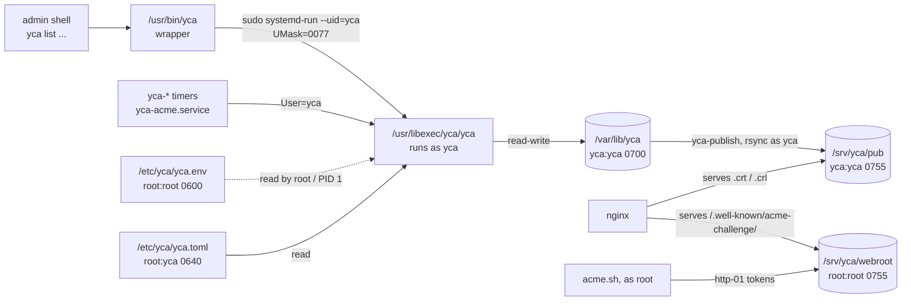

# Installation and configuration

From a distribution package (or a source checkout) to a running CA that
publishes its CRLs behind a reverse proxy. Linux paths are used
throughout; FreeBSD has [its own section](#freebsd) for what differs.

The order matters: installing the files is automated, but everything that
touches keys or secrets (config review, init) is deliberately manual - a
CA init is a ceremony, not a postinstall hook.

## How the pieces fit

Every operation on the CA runs as the `yca` service account, whether a
timer or an administrator starts it. The `yca` on `PATH` is a small
wrapper; the CLI itself lives in libexec.



| Path | Permissions | Purpose |
|------|-------------|---------|
| `/etc/yca` | `root:yca` 0750 | configuration directory |
| `/etc/yca/yca.toml` | `root:yca` 0640 | the service reads it but cannot rewrite its own policy |
| `/etc/yca/yca.env` | `root:root` 0600 | CA secrets for unattended jobs; read by systemd before it drops to `yca` |
| `/var/lib/yca` | `yca:yca` 0700 | store (`store/`), `acme.db`, `yca.log` |
| `/srv/yca` | `root:root` 0755 | parent of the two web roots below; `yca` cannot rename or replace them |
| `/srv/yca/pub` | `yca:yca` 0755 | published certificates and CRLs, written by `yca-publish`, served by nginx |
| `/srv/yca/webroot` | `root:root` 0755 | http-01 tokens written by acme.sh (root), served by nginx |

The packages create the account (system user, `nologin`, password
locked) and the directories, and `tmpfiles.d/yca.conf` re-applies these
owners and modes on every boot and package install. The systemd units are
installed but not enabled.

## 1. Install

| What | Why |
|------|-----|
| a distribution package (below) | CLI, `yca-acme`, wrapper, units, account and directories |
| `sudo` | the wrapper uses it unless run by root |
| openssl CLI | verification steps |
| nginx | reverse proxy for the repository host |
| a Nitrokey HSM + OpenSC, or SoftHSM | only for a `pkcs11` key backend |

`rsync` (used by `yca-publish`) and `systemd` are package dependencies.
Release assets are built for Debian Trixie, Fedora 44, Arch Linux and
FreeBSD 15; Gentoo builds from source through a local overlay.

### Debian / Ubuntu

```bash
sudo apt install ./yca_<version>-1~trixie_amd64.deb
```

### Fedora

```bash
sudo dnf install ./yca-<version>-1.fc44.x86_64.rpm
```

### Arch Linux

```bash
sudo pacman -U yca-<version>-1-x86_64.pkg.tar.zst
```

### Gentoo

Source-based: the ebuilds live under `packaging/gentoo/` in the yca repo
(`app-crypt/yca` plus `acct-group/yca` and `acct-user/yca` for the
account) and go into a local overlay, not an official or community one.
The units are systemd units; there are no OpenRC scripts.

```bash
# once: a local overlay
sudo emerge --noreplace app-eselect/eselect-repository
sudo eselect repository create local

# from a yca checkout
sudo cp -r packaging/gentoo/acct-group packaging/gentoo/acct-user \
    packaging/gentoo/app-crypt /var/db/repos/local/

printf '%s ~arm64\n' app-crypt/yca acct-user/yca acct-group/yca |
    sudo tee /etc/portage/package.accept_keywords/yca
# amd64 hosts: ~amd64 instead

sudo emerge app-crypt/yca
```

The ebuild fetches two distfiles: the tag's source tarball and
`yca-<version>-gentoo-go-vendor.tar.xz` from the release assets (the Go
modules of `yca-acme`), so the build runs offline under Portage's
`network-sandbox`.
Both are pinned in the `Manifest` by the release CI; emerge a version
once its release is published.

`acct-user/yca` takes over an existing `yca` account (for example one
created earlier with `useradd --system`) and sets its home to
`/var/lib/yca`. The directories and their owners come from `pkg_postinst`
(tmpfiles).

### From source

Requirements: Clang with libc++ and libc++abi, CMake 3.31+,
Ninja, SQLite3 headers, and Go (Botan and toml++ are vendored).

Build CLI and ACME server:

```bash
cmake -B build -G Ninja -DCMAKE_BUILD_TYPE=Release \
    -DCMAKE_INSTALL_PREFIX=/usr -DCMAKE_CXX_COMPILER=clang++
cmake --build build --target yca

cd acme && go build -ldflags "-X main.version=$(cat ../VERSION)" \
    -o ../bin/yca-acme .

sudo cmake --install build

sudo install -Dm755 bin/yca-acme /usr/bin/yca-acme
sudo install -Dm644 share/man/yca-acme.1 /usr/share/man/man1/yca-acme.1
sudo install -Dm644 share/zsh-completion/_yca-acme \
    /usr/share/zsh/site-functions/_yca-acme
sudo install -Dm600 yca.toml /etc/yca/yca.toml
sudo install -m644 share/systemd/*.service share/systemd/*.timer \
    /usr/lib/systemd/system/
```

Provision the account and directories:

```bash
sudo install -Dm644 share/sysusers.d/yca.conf /usr/lib/sysusers.d/yca.conf
sudo install -Dm644 share/tmpfiles.d/yca.conf /usr/lib/tmpfiles.d/yca.conf
sudo systemd-sysusers yca.conf
sudo systemd-tmpfiles --create yca.conf
sudo systemctl daemon-reload
```

If the `/usr` prefix is changed override `ExecStart=` (and `--yca`
for `yca-acme`) in a drop-in.

## 2. Configuration file

```bash
sudoedit /etc/yca/yca.toml
```

`sudoedit` keeps the file's owner and mode (`root:yca` 0640), `tmpfiles`
will restore them if modified.

The file is organized in sections, which is also the granularity at
which each is locked into the store: `[pki]`, an optional `[pkcs11]`,
`[root]`, and one `[ca.<purpose>]` per issuing CA. Fields to review
(see [README](../README.md#configuration) for reference):

- `[pki] org_name`, `country_code`, and each CA's `cn` - DN content.
- `[pki] repository_host` - the host serving the CRL/caIssuers URLs.
  Baked into every issued certificate; not changeable after init.
- each CA's `slug_prefix` - the stable part of the file/URL identifiers;
  the full slug is `<prefix><generation>` (root-e1, ca-e1 at init). They
  must be unique across CAs, and must not differ from one another only by
  digits.
- `[ca.<purpose>] profiles` - the EE profiles that CA issues, from
  `server`, `client`, `email`. A profile belongs to exactly one CA, and
  that is how issuance picks an issuer. A purpose declared here but not
  created at init is added later with `yca add signing-ca --purpose <p>`.
- validities; a CA's `ee_valid_days` doubles as its `--valid` ceiling and
  is itself capped by the strictest profile that CA lists. Everything is
  locked at init - re-initialize to change a materialized section.
- `[pki] arc_oid` - optional policy arc; omit to skip CertificatePolicies.
- `[ca.<purpose>] permitted_dns` / `permitted_email` - optional
  `nameConstraints` subtrees bounding who that CA may issue to.
- `[ca.<purpose>] simple_dn` - optional, default `false`. Subject DNs are
  encoded `C`, `O`, `CN`; `true` reduces the subject DN that CA issues to
  the bare `CN`, which suits TLS and is refused on a CA carrying the `email`
  profile. The CA's own DN is always the full one.
- `key_backend`, per CA - `internal` (software key, passphrase-encrypted
  in the store) or `pkcs11` (key on a token/HSM). Three HSM layouts
  exist: single token (every CA on the shared `[pkcs11] token_label`),
  split tokens (a `token_label` of its own under `[root]` puts the root
  key on a separate token) and hybrid (`[root] key_backend = "pkcs11"`
  with internal issuing keys). In the split and hybrid layouts the root
  token leaves the safe only for ceremonies: init, `add signing-ca`,
  `renew signing-ca`, `refresh crl root` and `revoke ca`.

## 3. Only for a `pkcs11` backend

Prepare the token(s) first - SoftHSM: [softhsm.md](softhsm.md); Nitrokey HSM 2:
[nitrokeyhsm.md](nitrokeyhsm.md) - then set `[pkcs11] module` and the label(s):
`[pkcs11] token_label` is the default every token-held CA falls back to,
and a CA may override it with its own `token_label` (required under `[root]`
in the hybrid layout, where no other CA is on a token to set the default).
`yca` makes exactly one login attempt per token per run.

The CLI talks to the token through pcscd, as `yca`. Where pcscd is built
with polkit and denies the account (the journal shows the denial), allow
it explicitly:

```js
// /etc/polkit-1/rules.d/60-yca-pcsc.rules
polkit.addRule(function (action, subject) {
    if ((action.id == "org.debian.pcsc-lite.access_pcsc" ||
         action.id == "org.debian.pcsc-lite.access_card") &&
        subject.user == "yca") {
        return polkit.Result.YES;
    }
});
```

## 4. Secrets and the init ceremony

Each operation needs only the secrets of the CA keys it touches:
`CA_STORE_PASSPHRASE` for keys on the `internal` backend, `CA_HSM_PIN`
for the signing token, `CA_HSM_ROOT_PIN` for the root token (falling
back to `CA_HSM_PIN`). They reach the CLI in two ways:

- **`/etc/yca/yca.env`** - for what the timers and `yca-acme` need
  unattended: the store passphrase or the signing token PIN. Root-only;
  systemd (and the wrapper, as root) read it, the `yca` account never
  does.
- **exported in the admin's shell** - for what must stay off disk: the
  root token PIN in the split and hybrid layouts. The wrapper passes the
  three variables above by name when they are set (never on a command
  line); for a variable set in both places, `yca.env` wins.

Create the env file first, so init and the timers use the same secret:

```bash
sudo install -m 600 /dev/null /etc/yca/yca.env

# internal backend: generate the passphrase, and keep a copy in your
# password manager - every issuance and revocation needs it
printf 'CA_STORE_PASSPHRASE=%s\n' "$(openssl rand -hex 20)" |
    sudo tee /etc/yca/yca.env > /dev/null

# pkcs11 signing token instead: sudoedit /etc/yca/yca.env
#   CA_HSM_PIN=<signing token user PIN>
```

Then initialize, as the admin (the wrapper supplies `--config
/etc/yca/yca.toml --store /var/lib/yca/store`):

```bash
yca init

# split / hybrid: the root PIN only for the ceremony, never on disk
read -rs CA_HSM_ROOT_PIN && export CA_HSM_ROOT_PIN
yca init
unset CA_HSM_ROOT_PIN
```

Without any `CA_STORE_PASSPHRASE` and with a key on the internal backend,
init generates a passphrase and **shows it exactly once** - put it into
`yca.env` and your password manager.

```bash
yca init

┌ CA_STORE_PASSPHRASE (shown once) ────────────────────────────────┐

  A4FECD7A17D9E7BB9C06D93AD3B4CD403A81595FCF00560A7093E68C16CA7FAD

└──────────────────────────────────────────────────────────────────┘

```

For every key on a `pkcs11` backend, an existing token keypair must already
be labeled with the derived CA slug (`<slug_prefix>1`, i.e. root-e1 / ca-e1
with the default prefixes) to be adopted, and a missing one is generated on
that key's token under exactly that label. Init needs every configured token
present; afterwards the split and hybrid layouts need the root token only for
ceremonies.

## 5. CRL refresh timers

Revocation is CRL-only, so the refresh timers are the revocation
infrastructure. They run unattended with the secret from `yca.env` - a
deliberate ceremony-vs-automation trade-off (see the unit headers):

```bash
sudo systemctl enable --now yca-crl-refresh.timer       # signing CRL, daily
sudo systemctl enable --now yca-root-crl-refresh.timer  # root CRL, quarterly
```

In the split and hybrid layouts the root timer cannot run unattended:
`refresh crl root` needs the root token plugged in and its PIN. Run it as
part of the quarterly root-token ceremony instead (`yca refresh crl root`
with the PIN exported, as above), and keep only the signing timer
enabled.

## 6. Repository host: publication and reverse proxy

Certificates point at `http://<repository_host>/...`, so that name must
resolve (DNS record, or a hosts entry in a lab) and nginx must serve it.

Publication (CA certificates and CRLs, hourly rsync from the store to
`/srv/yca/pub`):

```bash
sudo systemctl enable --now yca-publish.timer
sudo systemctl start yca-publish.service      # first publish immediately
ls /srv/yca/pub
```

The publish job mirrors the store strictly (`rsync --delete`, capped by
`--max-delete=8`): stale artifacts vanish after a re-init, while a
misconfigured or empty source makes the job fail loudly instead of wiping
the web root (see the yca-publish unit header).

Reverse proxy: the package ships an example server block
(`repository_host` is `pki.example.ca` in it). `/<slug>.crt` and
`/<slug>.crl` are served from `/srv/yca/pub`, `/.well-known/acme-challenge/`
from `/srv/yca/webroot`, `/acme/` goes to `yca-acme`; everything else is
closed. The HTTPS server block needs the endpoint certificate from the
[ACME TLS bootstrap](acme-operation.md#tls-bootstrap-chicken-and-egg-resolved-by-ceremony);
leave it out until then.

| Distribution | Example | Where it goes |
|--------------|---------|---------------|
| Debian | `/usr/share/doc/yca/examples/nginx/yca.conf` | `/etc/nginx/sites-available/yca.conf`, symlinked into `sites-enabled/` |
| Fedora | `/usr/share/doc/yca/examples/nginx/yca.conf` | `/etc/nginx/conf.d/yca.conf` |
| Arch | `/usr/share/yca/nginx/yca.conf` | `/etc/nginx/conf.d/yca.conf`; add `include /etc/nginx/conf.d/*.conf;` to the `http {}` block |
| Gentoo | `/usr/share/doc/yca-<version>/examples/yca.conf` | `/etc/nginx/conf.d/yca.conf`, included from `http {}` |

```bash
sed 's/pki.example.ca/<your repository_host>/g' <example> |
    sudo tee /etc/nginx/conf.d/yca.conf > /dev/null
sudo nginx -t && sudo systemctl enable --now nginx
```

Fedora (SELinux enforcing): rsync from the store to `/srv/yca/pub` is denied
until both paths carry the types built for content read and written by
rsync, and nginx needs the boolean for proxying to `yca-acme`:

```bash
sudo semanage fcontext -a -t public_content_t '/var/lib/yca/store/ca(/.*)?'
sudo restorecon -Rv /var/lib/yca/store/ca
sudo semanage fcontext -a -t public_content_rw_t '/srv/yca/pub(/.*)?'
sudo restorecon -Rv /srv/yca/pub
sudo setsebool -P rsync_anon_write on
sudo setsebool -P httpd_can_network_connect on
```

## 7. Trust the root on this host

Needed for anything local that verifies yca-issued certificates (acme.sh
against `yca-acme`, curl, the nginx upstream checks):

```bash
yca get ca --cn root-ca > root.pem

# Debian, Gentoo
sudo install -m 644 root.pem /usr/local/share/ca-certificates/ets-root-e1.crt
sudo update-ca-certificates

# Fedora, Arch
sudo trust anchor --store root.pem
sudo update-ca-trust
```

## 8. Verify the whole chain

```bash
yca --version                               # yca version X.Y.Z
systemctl list-timers 'yca-*'               # refresh + publish scheduled

# repository artifacts through the proxy
curl -I http://pki.example.ca/root-e1.crt   # 200, application/pkix-cert
curl -I http://pki.example.ca/ca-e1.crl

# the published CRLs verify against the published chain
curl -s http://pki.example.ca/ca-e1.crl |
    openssl crl -inform DER -noout \
        -CAfile <(curl -s http://pki.example.ca>/ca-e1.crt |
                  openssl x509 -inform DER)
# expect: "verify OK"

# issue and revoke a test certificate, watch it land on the CRL
yca create server --cn smoke.test --valid 5m
yca revoke server --cn smoke.test --reason superseded
sudo systemctl start yca-publish.service
curl -s http://pki.example.ca/ca-e1.crl |
    openssl crl -inform DER -noout -text | grep -A2 'Revoked Certificates'
```

## 9. Day-to-day operation

See `man yca` (including its OPERATOR WRAPPER section) and
[operation.md](operation.md). In short:

- `yca <command>` as the admin; the wrapper runs it as `yca`, with the
  packaged config and store unless `--config`/`--store` are given.
- The CLI runs in `/var/lib/yca` as `yca`, so it cannot open files in
  your home: pass a CSR on standard input or inline.

  ```bash
  yca sign server --id <id> --nonce "$(yca get nonce --id <id>)" \
      --csr - < host.csr
  ```

- Output goes to your terminal or pipe; files in the store need root to
  copy out, for example a delivered key:

  ```bash
  yca create server --cn host.example.ca
  yca get server --cn host.example.ca --chain > host.pem
  sudo install -m 600 -o <owner> /var/lib/yca/store/ee/host.example.ca.key \
      /path/to/host.key
  ```

- A revocation rewrites the signed CRL immediately; the published copy
  follows within the hour, or `sudo systemctl start yca-publish.service`
  pushes it now.
- The diagnostic log is `/var/lib/yca/yca.log` (`sudo less ...`);
  services also log to the journal.
- Re-initialization (new identity, changed locked fields) means a new
  store - and, with `pkcs11`, re-issues certificates over the same token
  keys.

`umask` in your own shell does not matter for the store: the CLI always
runs with umask 077 as `yca`. Keep the admin's umask at 022 (or 027):
a 077 umask follows you through `sudo` and makes files created by
package scripts or `sudo tee` unexpectedly unreadable.

## 10. Admin hygiene

- `yca` operations are administrative: the wrapper needs `sudo
  systemd-run`, which is root-equivalent and cannot be narrowed by
  sudoers to yca alone. Give it to the admin account only.
- Make `sudo` independent of the caller's umask, and log it:

  ```text
  # /etc/sudoers.d/defaults (visudo -f)
  Defaults umask=0022
  Defaults umask_override
  Defaults use_pty
  Defaults log_output
  ```

- A non-admin account that only restarts services gets an explicit list,
  never `systemctl edit` or `daemon-reload` (both amount to root):

  ```text
  # /etc/sudoers.d/yca-operator (visudo -f)
  operator ALL=(root) /usr/bin/systemctl restart yca-acme.service, \
                      /usr/bin/systemctl start yca-publish.service
  ```

- Unit changes (`systemctl edit`, drop-ins), package updates and config
  edits go through the admin account.

## FreeBSD

Tested with FreeBSD 15. Prefix `/usr/local`; the timers become rc.d,
periodic(8) and cron (`packaging/freebsd/{rc.d,periodic,crontab.sample}`).
HSM on FreeBSD is not tested.

| Linux | FreeBSD |
|-------|---------|
| `/etc/yca` | `/usr/local/etc/yca` |
| `/var/lib/yca` | `/var/db/yca` |
| `/usr/libexec/yca/yca` | `/usr/local/libexec/yca/yca` |
| `systemd-run` in the wrapper | `sudo sh` sources `yca.env` as root, then `su -m yca` |

```bash
pkg add yca-<version>-freebsd-15-amd64.pkg
pkg install nginx
```

The package creates the `yca` account (`nologin`, login disabled) and
`/usr/local/etc/yca` (`root:yca` 0750), `/var/db/yca` (`yca:yca` 0700),
`/srv/yca` (`root:wheel` 0755) with `pub/` (`yca:yca` 0755) and
`webroot/` (`root:wheel` 0755), as on Linux. Upgrades keep local edits
made to `yca.toml`.

Configuration, secrets and init are the same as on Linux (sections 2 and
4) with the FreeBSD paths; `yca.env` stays `root:wheel` 0600 - rc.subr
and the periodic script source it as root before switching to `yca`.

Services:

```bash
sudo sysrc yca_acme_enable=YES
sudo sysrc yca_acme_url=https://pki.example.ca
sudo service yca_acme start

echo 'daily_yca_crl_refresh_enable="YES"' | sudo tee -a /etc/periodic.conf.local
echo 'daily_yca_acme_renew_enable="YES"' | sudo tee -a /etc/periodic.conf.local
```

Publication (hourly) and the root CRL refresh (quarterly) have no
periodic(8) bucket: append the two lines from
`/usr/local/share/examples/yca/crontab.sample` to `/etc/crontab` (they
carry the user field: publish runs as `yca`, the root CRL refresh starts
as root to read `yca.env`).

nginx: make sure the `http {}` block in `/usr/local/etc/nginx/nginx.conf`
has `include /usr/local/etc/nginx/conf.d/*.conf;`, then

```bash
sudo mkdir -p /usr/local/etc/nginx/conf.d
sed 's/pki.example.ca/<your repository_host>/g' \
    /usr/local/share/examples/yca/nginx/yca.conf |
    sudo tee /usr/local/etc/nginx/conf.d/yca.conf > /dev/null
sudo nginx -t
sudo sysrc nginx_enable=YES
sudo service nginx start
```

Trust the root:

```bash
yca get ca --cn root-ca > root.pem
sudo install -m 644 root.pem /usr/local/share/certs/yca-root.crt
sudo certctl rehash
# libssl, s_client and friends from ports look in /usr/local/openssl
sudo ln -s /etc/ssl/cert.pem /usr/local/openssl/cert.pem
```

acme.sh (pkg) keeps its real `dnsapi/` (`dns_nsupdate.sh` and friends)
under its own working directory, `/var/db/acme/.acme.sh/dnsapi/`.
Pointing `--home`/`--config-home` at `/usr/local/etc/yca/acme` makes it
look for `dnsapi/` there and fail with "Cannot find DNS API hook for:
dns_nsupdate". Link it once, so it follows pkg upgrades:

```bash
sudo ln -s /var/db/acme/.acme.sh/dnsapi /usr/local/etc/yca/acme/dnsapi
```

## macOS

yca will compile on macOS 26 but its surrounding infrastructure is not
available on this target.
